---
## Front matter
lang: ru-RU
title: "лабораторной работе 1"
author:
  - Абдуллахи Бахара
institute:
  - Российский университет дружбы народов, Москва, Россия
date: 02 мар 2024

## i18n babel
babel-lang: russian
babel-otherlangs: english

## Fonts
mainfont: PT Serif
romanfont: PT Serif
sansfont: PT Sans
monofont: PT Mono
mainfontoptions: Ligatures=TeX
romanfontoptions: Ligatures=TeX
sansfontoptions: Ligatures=TeX,Scale=MatchLowercase
monofontoptions: Scale=MatchLowercase,Scale=0.9

## Formatting pdf
toc: false
toc-title: Содержание
slide_level: 2
aspectratio: 169
section-titles: true
theme: metropolis
header-includes:
 - \metroset{progressbar=frametitle,sectionpage=progressbar,numbering=fraction}
 - '\makeatletter'
 - '\beamer@ignorenonframefalse'
 - '\makeatother'
---

## Цель работы 

- Целью данной работы является приобретение практических навыков установки операционной системы на виртуальную машину, настройки минимально необходимых для дальнейшей работы сервисов.

## Задание

- Я уже установила виртуальный Virtualbox в прошлом семестре, поэтому мне не нода было.
Следующим шагом будет загрузка Linux Feedora Sway.

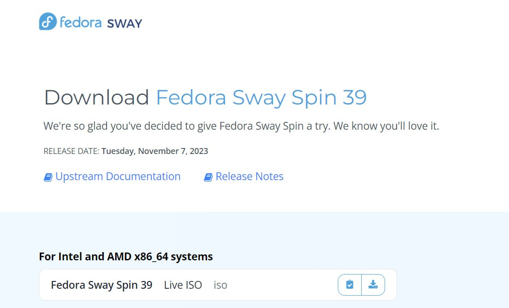

## Далее вам необходимо установить Linux Fedora Sway на виртуальную машину.

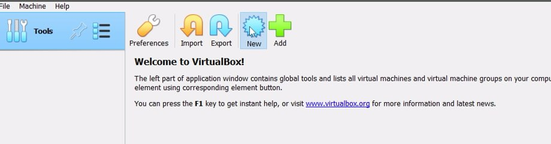

## нужно указать объем памяти и я указала 8192 мб

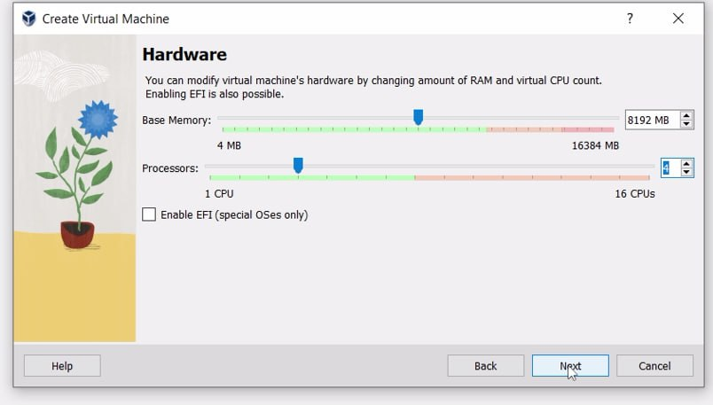

## Измените размер виртуального жесткого диска на 80 ГБ.

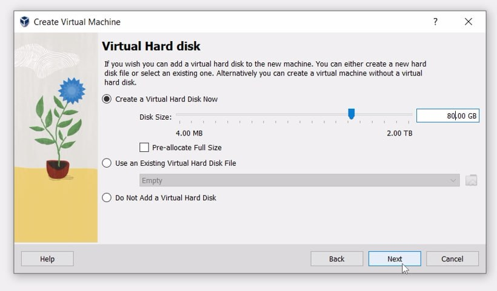

## Теперь вам нужно открыть настройку, изменить настройку дисплея и выбрать 3D.

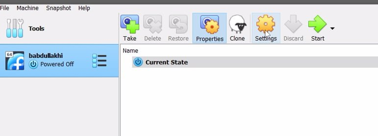

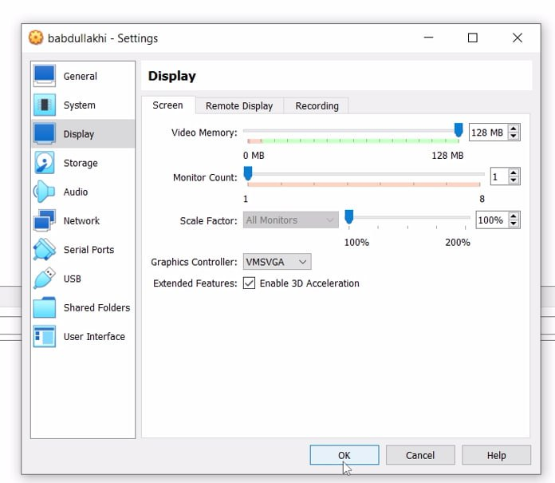

## Теперь все готово и вам нужно запустить виртуальную машину.

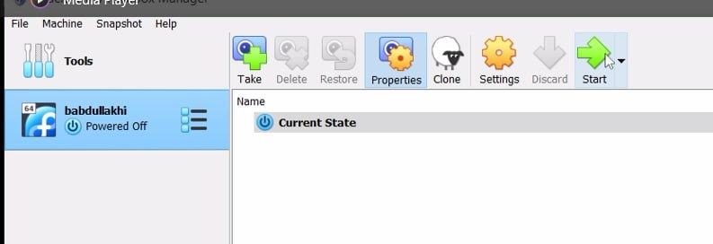

## запустила виртуальную машину через Troubleshooting:

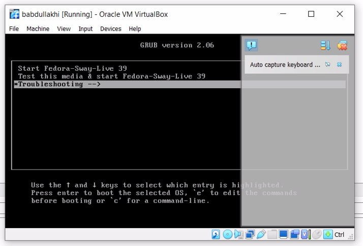

## машина запустилась:

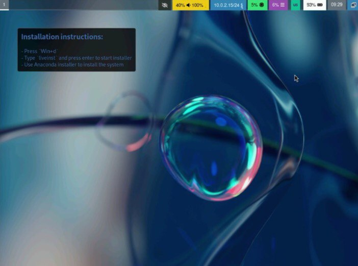

## Чтобы начать установку Fedora, вам нужно нажать клавишу Ctrl+d, откроется экран и вам нужно написать Liveinst.

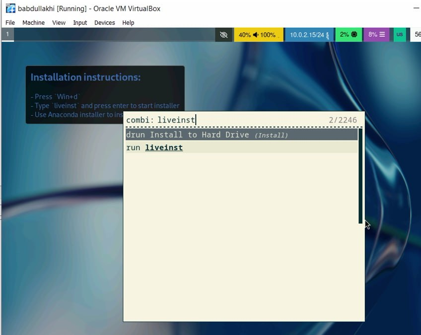

## выбрала русский язык для установки:
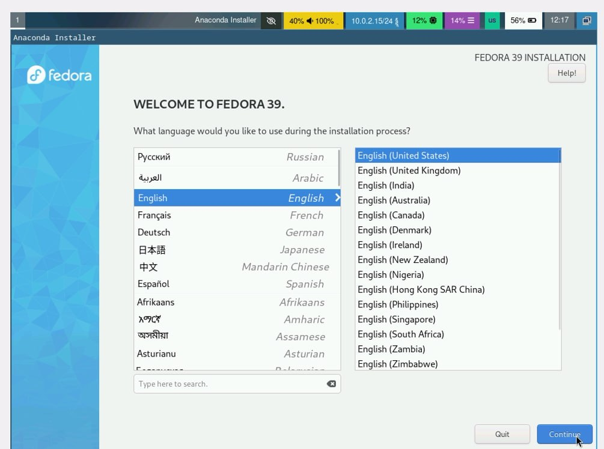

## Настройка клавиатуры (английская и русская)

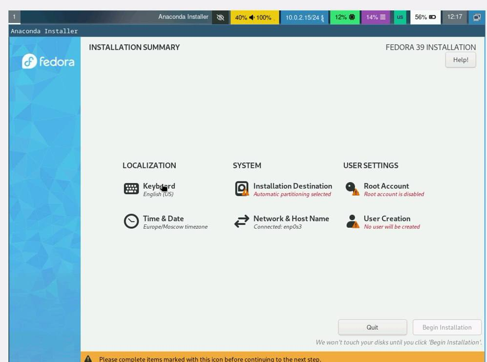

## Теперь вам нужно создать имя пользователя и пароль.
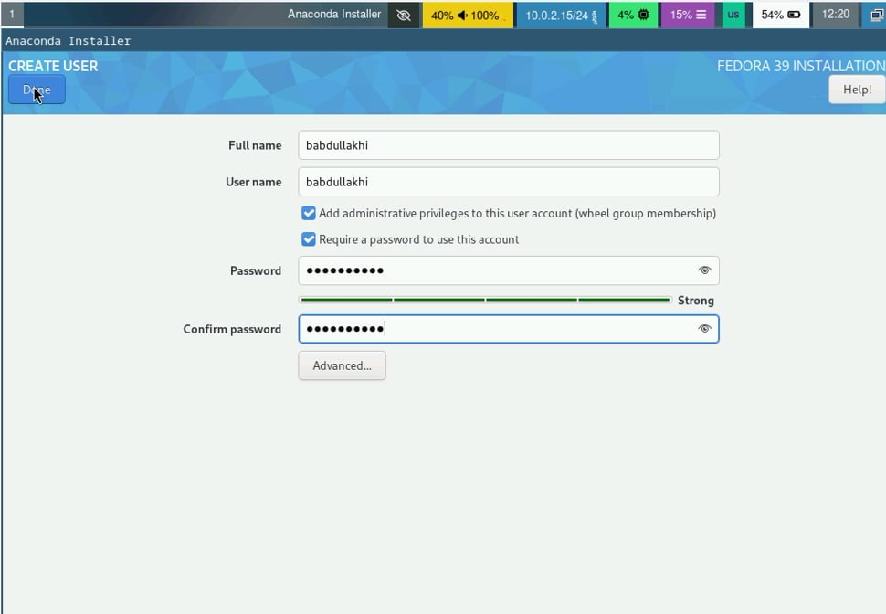

## Теперь все готово и можно приступать к установке и я начала установку
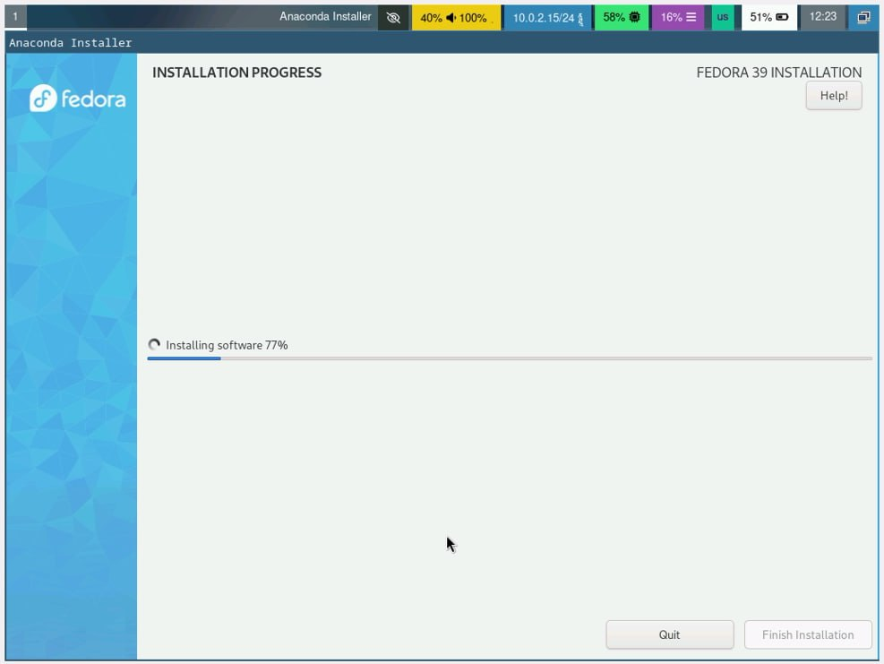

## После завершения установки необходимо завершить работу.

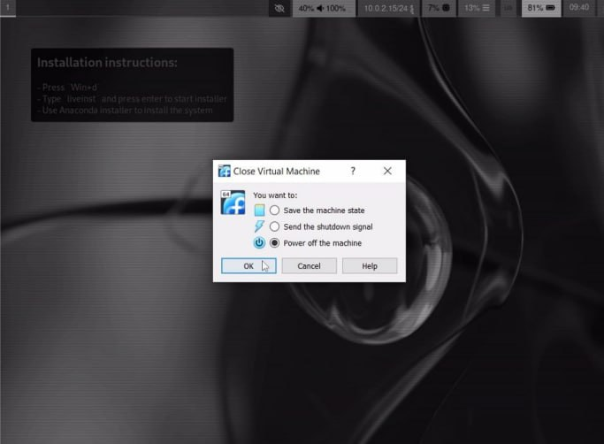

## Теперь в разделе «носители» нужно извлечь диск из привода и перезагрузите машину все работает нормально.
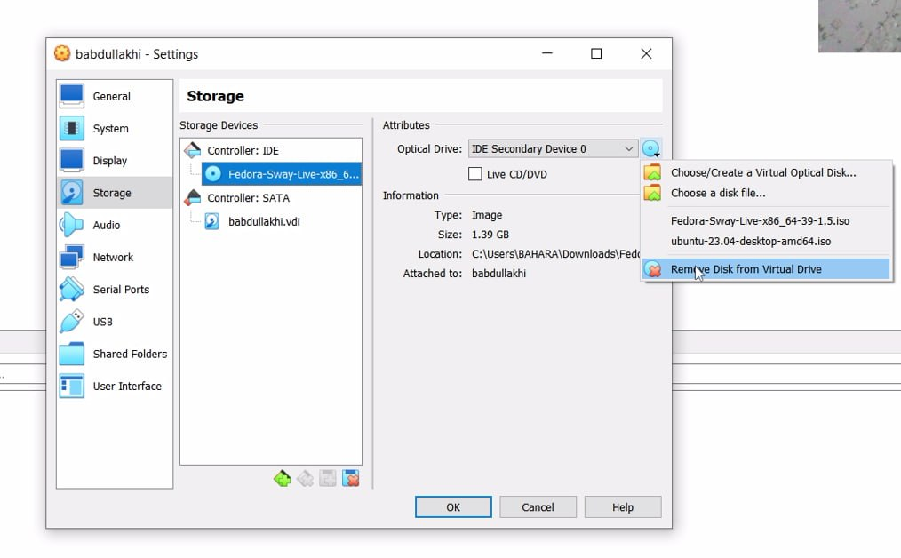
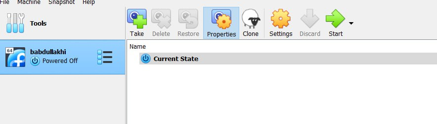
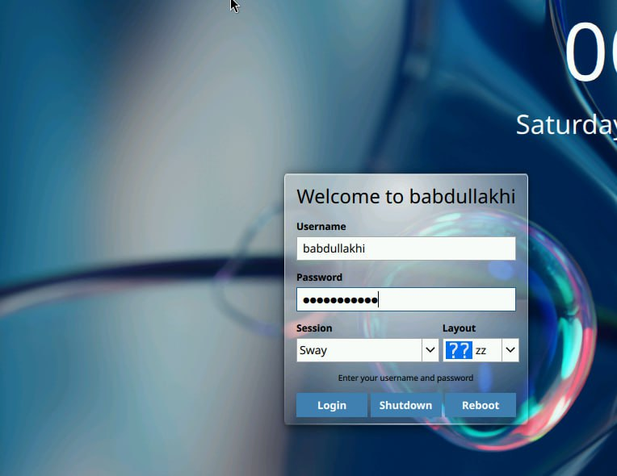

# домашнее задание:

## Версия ядра Linux

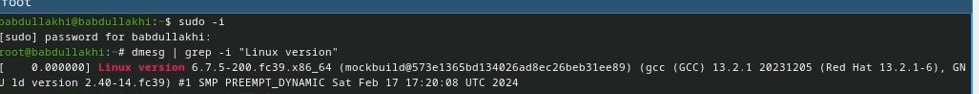

## частота процессора 

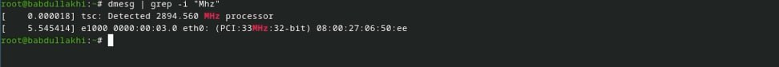

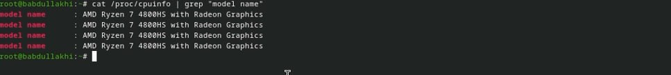

## Доступная объем RAM (Memory available):

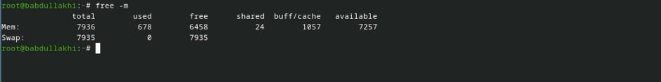

## Тип обнаруженного гипервизора

## Тип файловой системы корневого раздела

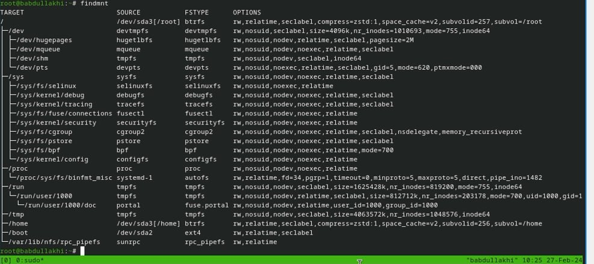

## Последовательность монтирования файловой системы

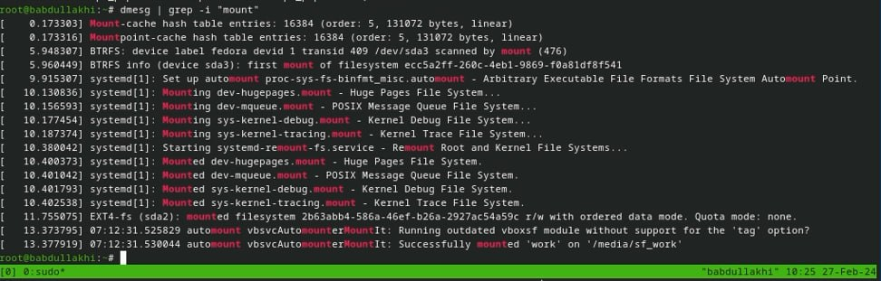

## Вывод :
- в ходе работы были установка виртуальной машины и операционной системы на ней, а также настройка основных служб — это фундаментальный аспект управления и развертывания ИТ-инфраструктуры.

# Спасибо за внимание ! 
