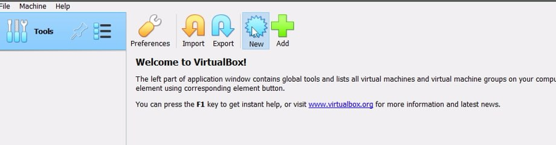
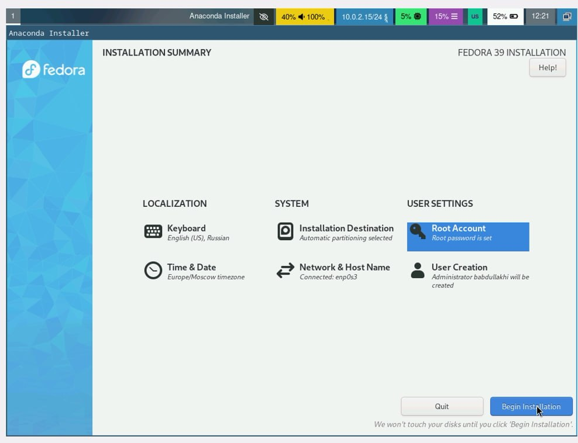

---
## Front matter
title: "Шаблон отчёта по лабораторной работе 1 "
subtitle: "Простейший вариант"
author: "Абдуллахи Бахара"

## Generic otions
lang: ru-RU
toc-title: "Содержание"

## Bibliography
bibliography: bib/cite.bib
csl: pandoc/csl/gost-r-7-0-5-2008-numeric.csl

## Pdf output format
toc: true # Table of contents
toc-depth: 2
lof: true # List of figures
lot: true # List of tables
fontsize: 12pt
linestretch: 1.5
papersize: a4
documentclass: scrreprt
## I18n polyglossia
polyglossia-lang:
  name: russian
  options:
	- spelling=modern
	- babelshorthands=true
polyglossia-otherlangs:
  name: english
## I18n babel
babel-lang: russian
babel-otherlangs: english
## Fonts
mainfont: PT Serif
romanfont: PT Serif
sansfont: PT Sans
monofont: PT Mono
mainfontoptions: Ligatures=TeX
romanfontoptions: Ligatures=TeX
sansfontoptions: Ligatures=TeX,Scale=MatchLowercase
monofontoptions: Scale=MatchLowercase,Scale=0.9
## Biblatex
biblatex: true
biblio-style: "gost-numeric"
biblatexoptions:
  - parentracker=true
  - backend=biber
  - hyperref=auto
  - language=auto
  - autolang=other*
  - citestyle=gost-numeric
## Pandoc-crossref LaTeX customization
figureTitle: "Рис."
tableTitle: "Таблица"
listingTitle: "Листинг"
lofTitle: "Список иллюстраций"
lotTitle: "Список таблиц"
lolTitle: "Листинги"
## Misc options
indent: true
header-includes:
  - \usepackage{indentfirst}
  - \usepackage{float} # keep figures where there are in the text
  - \floatplacement{figure}{H} # keep figures where there are in the text
---

# Цель работы

Целью данной работы является приобретение практических навыков установки операционной системы на виртуальную машину, настройки минимально необходимых для дальнейшей работы сервисов.

# Задание
 Я уже установила виртуальный Virtualbox в прошлом семестре, поэтому мне не нода было.
Следующим шагом будет загрузка Linux Feedora Sway.
 
{#fig:001 width=100%}

-Далее вам необходимо установить Linux Fedora Sway на виртуальную машину.
{#fig:001 width=100%}

{#fig:001 width=100%}

-нужно указать объем памяти и я указала 8192 мб

{#fig:001 width=100%}

-Измените размер виртуального жесткого диска на 80 ГБ.

{#fig:001 width=100%}

-Теперь вам нужно открыть настройку, изменить настройку дисплея и выбрать 3D.

{#fig:001 width=100%}

{#fig:001 width=710%}

-Теперь все готово и вам нужно запустить виртуальную машину.

{#fig:001 width=100%}

-Я запустила виртуальную машину через Troubleshooting:

{#fig:001 width=100%}

-машина запустилась:

{#fig:001 width=100%}

-Чтобы начать установку Fedora, вам нужно нажать клавишу Ctrl+d, откроется экран и вам нужно написать Liveinst.

{#fig:001 width=100%}

-Я выбрала русский язык для установки:

{#fig:001 width=100%}

Настройка клавиатуры (английская и русская)

{#fig:001 width=100%}

-При выборе места установки оставим все как есть.

{#fig:001 width=100%}

-Теперь вам нужно создать имя пользователя и пароль.

{#fig:001 width=100%}

-Теперь все готово и можно приступать к установке.

{#fig:001 width=100%}

-установка окончена

{#fig:001 width=100%}

-После завершения установки необходимо завершить работу.

{#fig:001 width=100%}

-Теперь в разделе «носители» нужно извлечь диск из привода.

{#fig:001 width=100%}

-перезагрузите машину

{#fig:001 width=100%}

-и все работает нормально.

{#fig:001 width=100%}

{#fig:001 width=100%}

# домашнее задание:

1: Версия ядра Linux
можно посмотреть командой dmsg | grep-i "Linux version"

{#fig:001 width=100%}

2:частота процессора (обнаруженный Mhz процессор)
можно посмотреть командой dmsg |grep-i "Mhz"

{#fig:001 width=100%}

3: модель процессора(CPU0)
можно посмотреть командой cat/proc/cpuinfo|grep "model name"

{#fig:001 width=100%}

4:Доступная сумма RAM (Memory available)
можно посмотреть командой free-m

{#fig:001 width=100%}

5:Тип обнаруженного гипервизора,можно посмотреть командой dmsg|grep-i "hypervisor detected"

{#fig:001 width=100%}

6: Тип файловой системы корневого раздела,ожно посмотреть командой findmnt

{#fig:001 width=100%}

7: Последовательность монтирования файловой системы:можно посмотреть командой dmsg|grep-i "mount"

{#fig:001 width=100%}

{#fig:001 width=70%}

Описываются проведённые действия, в качестве иллюстрации даётся ссылка на иллюстрацию (рис. [-@fig:001]).

{#fig:001 width=70%}
`ё``
# Выводы

Здесь кратко описываются итоги проделанной работы.

# Список литературы{.unnumbered}

::: {#refs}
:::
