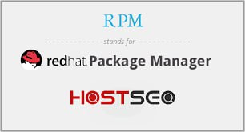
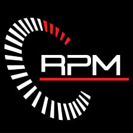
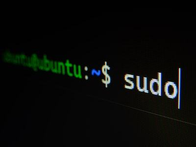

---
## Front matter
lang: ru-RU
title: система управления пакетами RPM (Red Hat Package Manager)
author:
  -  "Абдуллахи Бахара"
institute:
  - Российский университет дружбы народов, Москва, Россия
  
date: 17 Май 2024

## i18n babel
babel-lang: russian
babel-otherlangs: english

## Fonts
mainfont: PT Serif
romanfont: PT Serif
sansfont: PT Sans
monofont: PT Mono
mainfontoptions: Ligatures=TeX
romanfontoptions: Ligatures=TeX
sansfontoptions: Ligatures=TeX,Scale=MatchLowercase
monofontoptions: Scale=MatchLowercase,Scale=0.9

## Formatting pdf
toc: false
toc-title: Содержание
slide_level: 2
aspectratio: 169
section-titles: true
theme: metropolis
header-includes:
 - \metroset{progressbar=frametitle,sectionpage=progressbar,numbering=fraction}
 - '\makeatletter'
 - '\beamer@ignorenonframefalse'
 - '\makeatother'
---

## ведение: 

- RPM (Red Hat Package Manager) - это система управления пакетами, разработанная Red Hat для дистрибутивов на основе Linux, таких как Red Hat Enterprise Linux, Fedora и CentOS. RPM упрощает установку, обновление и удаление программного обеспечения на Linux-системах.

##  Что такое RPM?
- RPM (Red Hat Package Manager) является системой управления пакетами, созданной компанией Red Hat для дистрибутивов Linux, таких как Red Hat Enterprise Linux, Fedora и CentOS. С помощью RPM пользователи могут легко устанавливать, обновлять и удалять программное обеспечение на своих Linux-системах. RPM обеспечивает централизованное управление пакетами, упрощая процесс установки и обновления приложений

##  Цель использования RPM:
- 1. Упрощение процесса установки программ: RPM позволяет легко устанавливать новые программы на компьютер без необходимости ручной загрузки и установки файлов.
- 2. Обеспечение целостности и безопасности системы: RPM контролирует зависимости между пакетами, что помогает избежать конфликтов и обеспечивает стабильную работу системы.
- 3. Управление обновлениями: RPM обеспечивает простой способ обновления установленных программ до последних версий с автоматическим разрешением зависимостей.
- 4. Создание собственных пакетов: RPM позволяет разработчикам создавать собственные пакеты для дистрибуции своего программного обеспечения, что упрощает процесс установки и обновления приложений для пользователей.
- 5. Централизованное управление программным обеспечением: RPM обеспечивает централизованный доступ к репозиториям пакетов, где пользователи могут найти и установить необходимое им программное обеспечение.
 
Таким образом, цель использования RPM заключается в обеспечении удобного и эффективного управления программным обеспечением на операционных системах Linux, повышении безопасности и стабильности системы, а также упрощении процесса установки и обновления программ для пользователей и разработчиков.

## История развития RPM:
- (Red Hat Package Manager) была разработана компанией Red Hat в начале 1990-х годов. Она была создана как решение для эффективного управления программным обеспечением в операционных системах на базе Linux.
Изначально RPM была разработана для дистрибутива Red Hat Linux, но быстро стала стандартом де-факто для многих других дистрибутивов, основанных на Red Hat, таких как Fedora, CentOS и RHEL. 

# Создание RPM: RPM был впервые разработан в 1997 году компанией Red Hat для упрощения управления пакетами в своем дистрибутиве Linux.

# Расширение использования: По мере роста популярности Red Hat Enterprise Linux и Fedora, RPM стал стандартной системой управления пакетами в широком спектре дистрибутивов Linux.

#  Непрерывное совершенствование: За последние два десятилетия RPM постоянно совершенствовался, расширяя свои возможности и адаптируясь к меняющимся потребностям пользователей Linux.

##  Структура RPM-пакета:
- RPM-пакет представляет собой архив, содержащий программное обеспечение, метаданные и инструкции по установке. Он включает в себя файлы исполняемого кода, библиотеки, документацию и прочие необходимые компоненты для корректной работы приложения.
Внутренняя структура пакета RPM организована таким образом, чтобы упростить процесс установки, обновления и удаления программного обеспечения на Linux-системах.

## Установка и удаление пакетов с помощью RPM:

- Установка пакетов : Для установки нового RPM-пакета на систему используется команда rpm -i имя_пакета.rpm. Это устанавливает пакет со всеми необходимыми зависимостями и файлами.

- Обновление пакетов: Команда rpm -U имя_пакета.rpm позволяет обновить установленный пакет до новой версии, сохраняя при этом все конфигурационные данные.

- Удаление пакетов:  Чтобы удалить пакет, используется команда rpm -e имя_пакета. Это безопасно удаляет пакет вместе со всеми зависимыми файлами и компонентами.
Проверка установленных пакетов: Команда rpm -qa выводит полный список всех установленных на системе пакетов RPM.

## Обновление и поиск пакетов в RPM:

-  1. Обновление пакетов: С помощью команды rpm -U имя_пакета.rpm можно легко обновить установленные пакеты на Linux-системе до новых версий. Это позволяет получать последние улучшения и исправления ошибок.

- 2. Поиск пакетов: Команда rpm -q имя_пакета позволяет узнать, установлен ли на системе определенный пакет RPM. А rpm -qa выведет полный список всех установленных пакетов.

- 3. Информация о пакетах: Используя rpm -qi имя_пакета, можно получить подробную информацию об установленном пакете, включая версию, описание и зависимости.

## Зависимости пакетов и их управление:
- Зависимости пакетов - это требования, которые один пакет имеет к другим пакетам или библиотекам для своей работы. Управление зависимостями в RPM Package Manager (RPM) включает в себя следующие аспекты:

# 1. Зависимости пакетов:
 - Зависимости "Requires": Пакет может указывать другие пакеты, которые ему необходимы для правильной работы. Это делается с помощью тега "Requires" в спецификации пакета.
 - Зависимости "Provides": Пакет может также указывать, какие возможности или функциональность он предоставляет другим пакетам. Это делается с помощью тега "Provides" в спецификации пакета.
 
# 2. Разрешение зависимостей:
 - Автоматическое разрешение зависимостей: При установке пакета RPM автоматически проверяет наличие всех необходимых зависимостей и, если они отсутствуют, предлагает установить их.
- Ручное разрешение зависимостей: В некоторых случаях может потребоваться ручное разрешение зависимостей, особенно если есть конфликты или специфичные требования.
 
# 3. Управление зависимостями:
 - Установка зависимостей: Если пакет требует другие пакеты, RPM автоматически устанавливает их при установке основного пакета.

 - Обновление зависимостей: При обновлении пакета RPM проверяет, что все зависимости по-прежнему удовлетворены. Если требуется обновление зависимости, RPM предлагает его выполнить.
 - Удаление зависимостей: Если пакет больше не нужен, RPM проверяет, что другие пакеты, зависящие от него, все еще могут работать без проблем. Если это так, пакет может быть удален.
 
# 4. Управление репозиториями:
 
 - Репозитории зависимостей: RPM использует репозитории для поиска и загрузки пакетов и их зависимостей. Управление репозиториями включает добавление, удаление и настройку доступных репозиториев.
 
# 5. Разрешение конфликтов:
 - Конфликты зависимостей: Иногда возникают конфликты между зависимостями разных пакетов. RPM предоставляет механизмы для разрешения этих конфликтов, например, путем удаления или замены пакетов.
- Управление зависимостями в RPM позволяет обеспечить правильную установку, обновление и удаление пакетов, учитывая их требования к другим пакетам или библиотекам.

## Форма Пакет RPM:

 - это архив, который содержит следующие элементы:
• Заголовок пакета: Содержит метаданные о пакете, такие как имя, версия, зависимости и описание.
• Файлы: Файлы, необходимые для установки программного обеспечения.
• Подписи: Цифровые подписи, которые используются для проверки целостности пакета.т пакета RPM:

## Ограничения RPM:
- Несмотря на свои преимущества, RPM имеет некоторые ограничения:
• Зависимость от дистрибутива: Пакеты RPM зависят от дистрибутива Linux, в котором они были созданы. Это означает, что пакеты, созданные для одного дистрибутива, могут не работать в другом.
• Сложность для начинающих: Утилиты RPM могут показаться сложными для начинающих пользователей Linux.
• Ограничения на изменения файлов: RPM не позволяет изменять файлы, принадлежащие другим пакетам, что может привести к конфликтам.

## Альтернативы RPM:
- Существуют и другие системы управления пакетами для Linux, такие как:
• dpkg: Используется в Debian и Ubuntu.
• pacman: Используется в Arch Linux.
• portage: Используется в Gentoo Linux.

## Заключение:
- В ходе доклада мы рассмотрели систему управления пакетами RPM, которая играет ключевую роль в операционных системах на базе Linux. RPM была разработана компанией Red Hat и стала стандартом для многих дистрибутивов.Основные преимущества RPM включают надежность, гибкость и наличие комплексного набора инструментов для управления программным обеспечением. RPM обеспечивает целостность системы, отслеживая зависимости между пакетами.Несмотря на некоторые ограничения, RPM остается ключевой технологией в экосистеме Linux, продолжая развиваться и адаптироваться к современным требованиям. Таким образом, RPM является важным инструментом для системных администраторов и пользователей Linux.

# Спасибо за внимание!
