---
## Front matter
lang: ru-RU
title: " Лабораторной работе 2 "
author:
  - Абдуллахи Бахара 
institute:
  - Российский университет дружбы народов, Москва, Россия

date: 02 Мар 2024

## i18n babel
babel-lang: russian
babel-otherlangs: english

## Fonts
mainfont: PT Serif
romanfont: PT Serif
sansfont: PT Sans
monofont: PT Mono
mainfontoptions: Ligatures=TeX
romanfontoptions: Ligatures=TeX
sansfontoptions: Ligatures=TeX,Scale=MatchLowercase
monofontoptions: Scale=MatchLowercase,Scale=0.9
---

## Цель работы

- Изучить идеологию и применение средств контроля версий.
Освоить умения по работе с git.

## Задание
- Последовательность работ по установке программного обеспечения:

## Сначала установили git

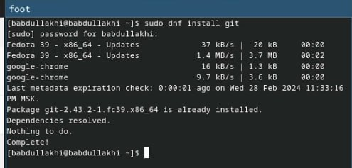

## затем установил gh Fedora:

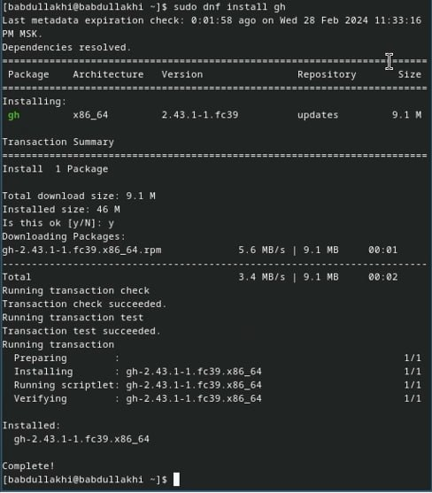

## Теперь базовая настройка git: давайте установим имя владельца репозитория.

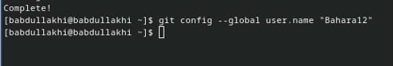

## Теперь базовая настройка git: давайте установим email владельца репозитория.

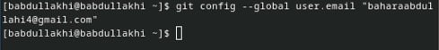

## Настройка utf-8 в выводе сообщения git и Настройте имя начальной ветки 

- Параметр аutocrlf
- параметр Safecrlf

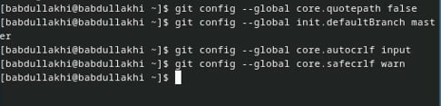

## Создайте ключи ssh с использованием алгоритма rsa с размером ключа 4096 бит.

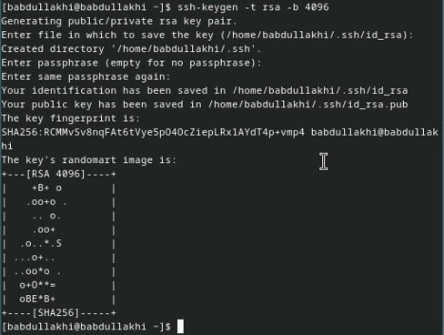

## затем используйте алгоритм ed25519:

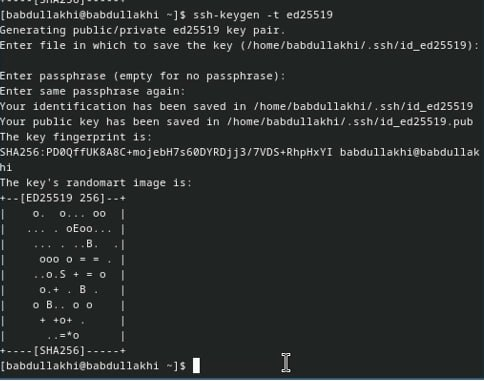

## Создание ключей pgp:
Генерация ключа.

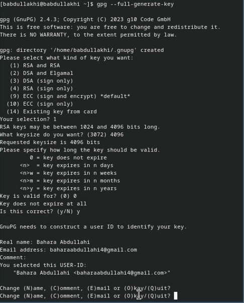
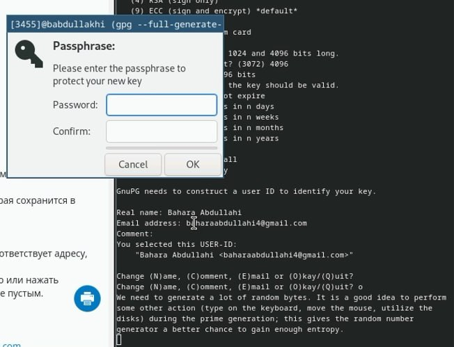

## Добавьте ключи PGP в GitHup: 
- затем покажите нам список ключей и скопируйте отпечаток закрытого ключа.

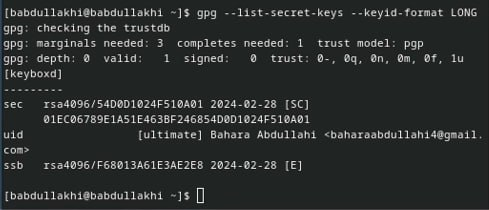

## Заходим на GitHup(http://githup.com/setting/key), нажимаем кнопку New GPG key и вставляем полученный в поле ввода.

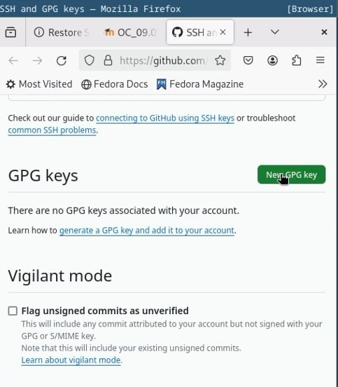
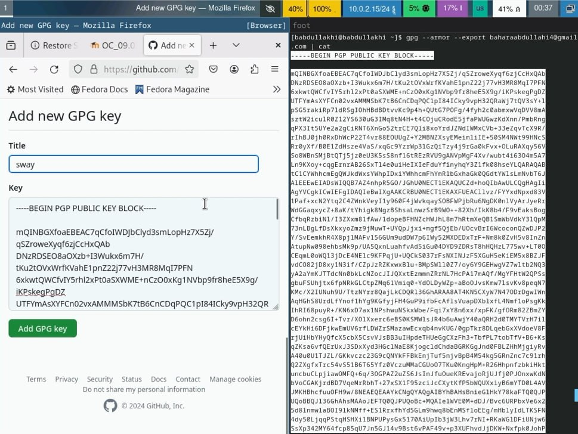
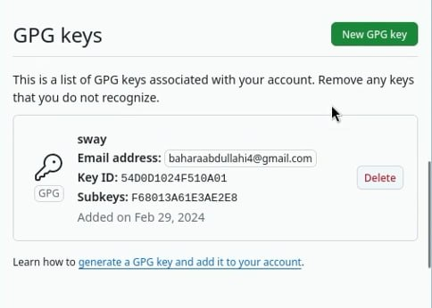

## Настройка автоматического подписания коммитов git

- веденный адрес электронной почты, скажите Git использовать его при подписании коммитов:

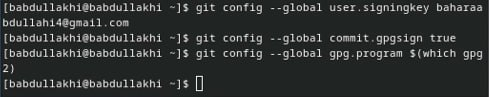

## Настройка gh:
- Сначала необходимо войти в систему.

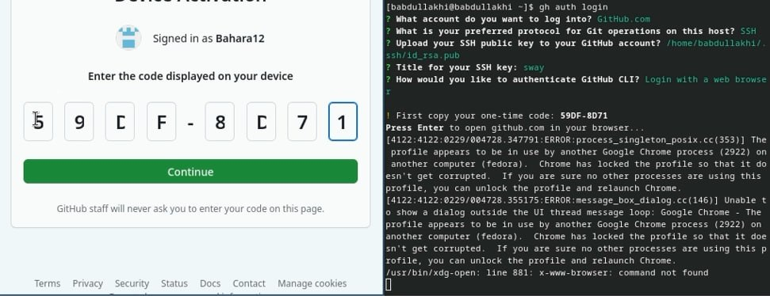
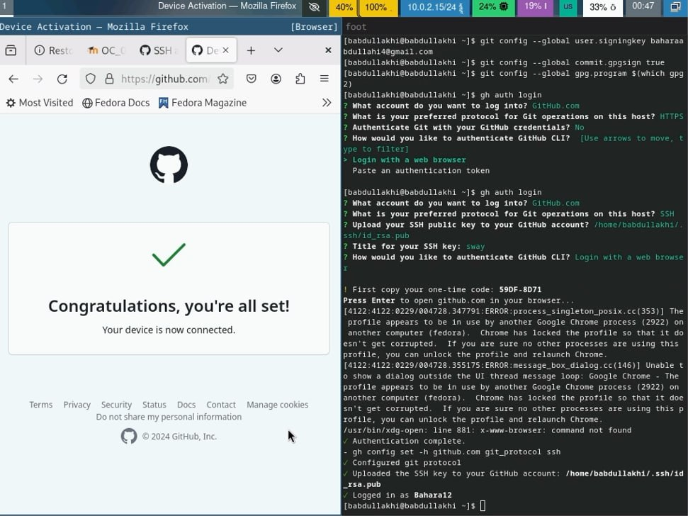

## Настройка каталога курса. Перейдите в каталог курса:

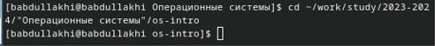

## Удалите ненужные файлы и создайте необходимые каталоги:

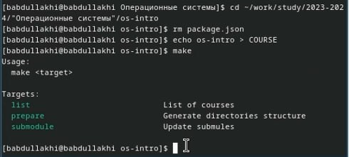
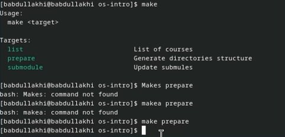

## Загрузить сервер:

- Можно загрузить файлы на сервер с помощью команды

1. git add .

2. git commit -am 'bahara'

3. git push

## Вывод :

- В ходе лабораторной работы мы изучили использование средств контроля версий, таких как Git. Это позволяет нам отслеживать изменения в коде и документах, сохраняя историю изменений для удобства совместной работы над проектами.

# Спасибо за внимание ! 
