---
## Front matter
title: "Шаблон отчёта по лабораторной работе 2 "
subtitle: "Простейший вариант"
author: "Абдуллахи Бахара"

## Generic otions
lang: ru-RU
toc-title: "Содержание"

## Bibliography
bibliography: bib/cite.bib
csl: pandoc/csl/gost-r-7-0-5-2008-numeric.csl

## Pdf output format
toc: true # Table of contents
toc-depth: 2
lof: true # List of figures
lot: true # List of tables
fontsize: 12pt
linestretch: 1.5
papersize: a4
documentclass: scrreprt
## I18n polyglossia
polyglossia-lang:
  name: russian
  options:
	- spelling=modern
	- babelshorthands=true
polyglossia-otherlangs:
  name: english
## I18n babel
babel-lang: russian
babel-otherlangs: english
## Fonts
mainfont: PT Serif
romanfont: PT Serif
sansfont: PT Sans
monofont: PT Mono
mainfontoptions: Ligatures=TeX
romanfontoptions: Ligatures=TeX
sansfontoptions: Ligatures=TeX,Scale=MatchLowercase
monofontoptions: Scale=MatchLowercase,Scale=0.9
## Biblatex
biblatex: true
biblio-style: "gost-numeric"
biblatexoptions:
  - parentracker=true
  - backend=biber
  - hyperref=auto
  - language=auto
  - autolang=other*
  - citestyle=gost-numeric
## Pandoc-crossref LaTeX customization
figureTitle: "Рис."
tableTitle: "Таблица"
listingTitle: "Листинг"
lofTitle: "Список иллюстраций"
lotTitle: "Список таблиц"
lolTitle: "Листинги"
## Misc options
indent: true
header-includes:
  - \usepackage{indentfirst}
  - \usepackage{float} # keep figures where there are in the text
  - \floatplacement{figure}{H} # keep figures where there are in the text
---

# Цель работы
Изучить идеологию и применение средств контроля версий.
Освоить умения по работе с git.

# Задание
Последовательность работ по установке программного обеспечения
-Сначала установили git

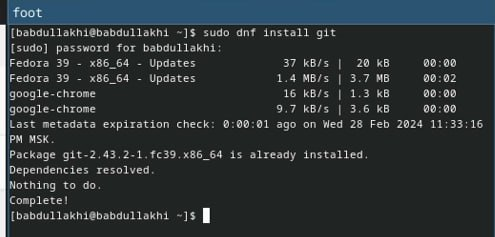{#fig:001 width=100%}

-затем установил gh Fedora:

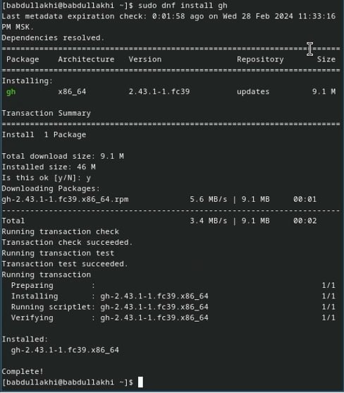{#fig:001 width=100%}

-Теперь базовая настройка git: давайте установим имя владельца репозитория.

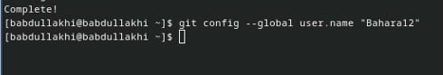{#fig:001 width=100%}

-Теперь базовая настройка git: давайте установим email владельца репозитория.

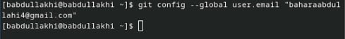{#fig:001 width=100%}

-Настройка utf-8 в выводе сообщения git
-Настройте имя начальной ветки( 
-Параметр аutocrlf
-параметр Safecrlf

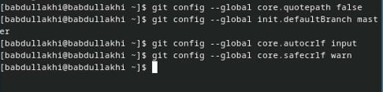{#fig:001 width=100%}

-Создайте ключи ssh с использованием алгоритма rsa с размером ключа 4096 бит.

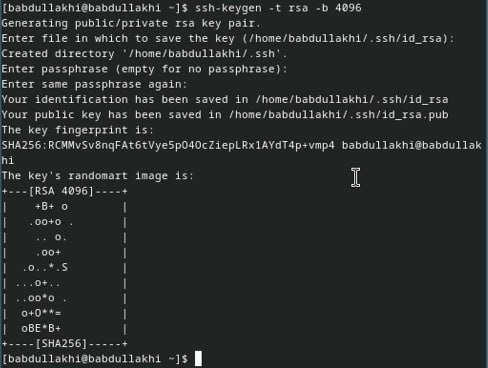{#fig:001 width=100%}

-затем используйте алгоритм ed25519

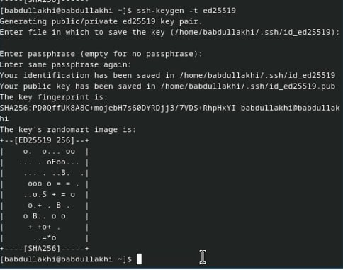{#fig:001 width=100%}

-Создание ключей pgp. Генерация ключа.

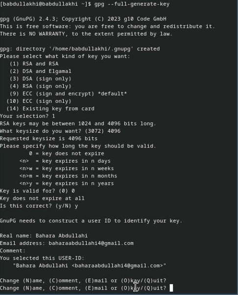{#fig:001 width=100%}
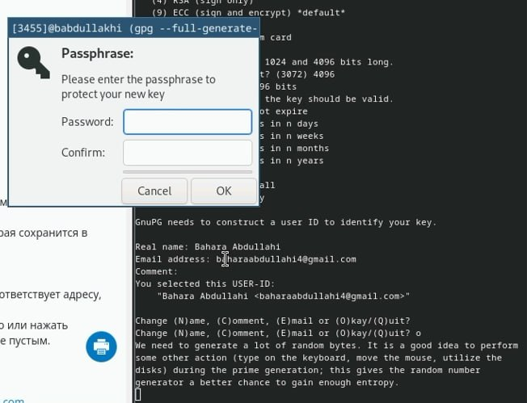{#fig:001 width=100%}

-Настройка Githup: я создала GitHupit в прошлом семестре.

-Добавьте ключи PGP в GitHup, затем покажите нам список ключей и скопируйте отпечаток закрытого ключа:

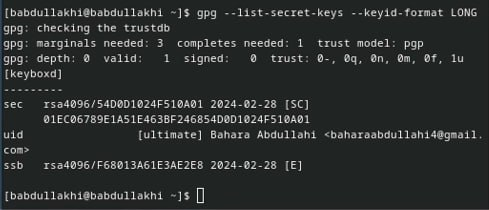{#fig:001 width=100%}

-Скопируйте сгенерированный ключ PGP в буфер обмена:

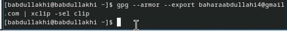{#fig:001 width=100%}

-Заходим на GitHup(http://githup.com/setting/key), нажимаем кнопку New GPG key и вставляем полученный в поле ввода.

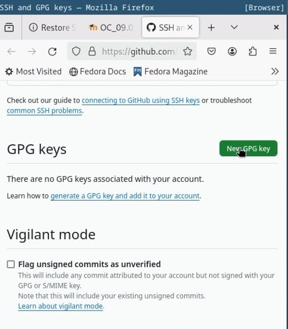{#fig:001 width=100%}

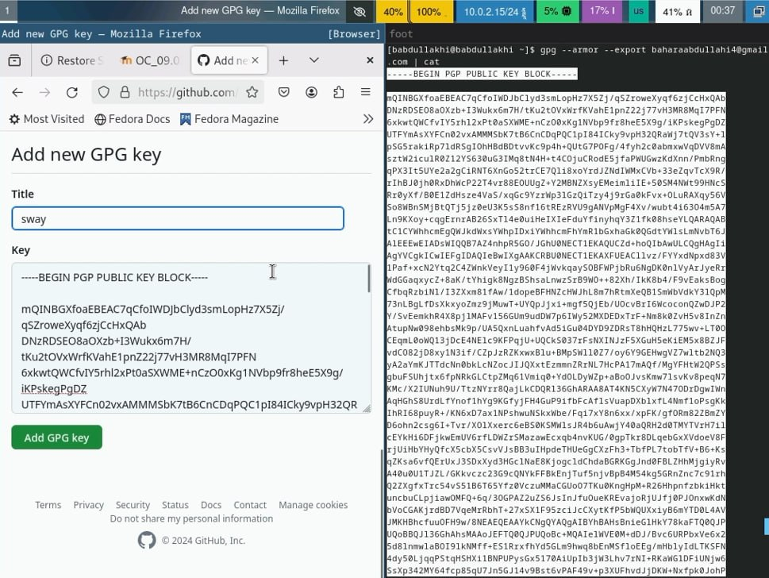{#fig:001 width100%}

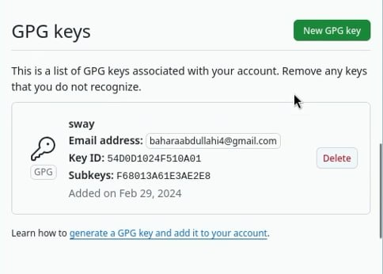{#fig:001 width=100%}

-Настройка автоматического подписания коммитов git, веденный адрес электронной почты, скажите Git использовать его при подписании коммитов:

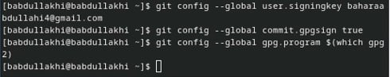{#fig:001 width=100%}

-Настройка gh Сначала необходимо войти в систему.

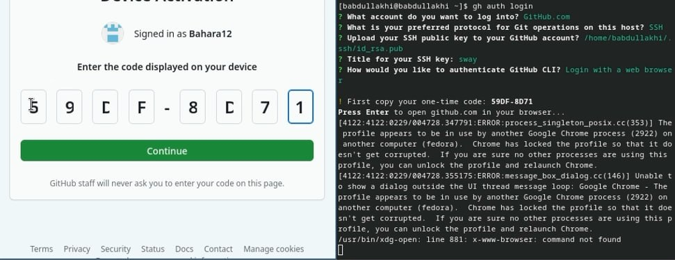{#fig:001 width=100%}
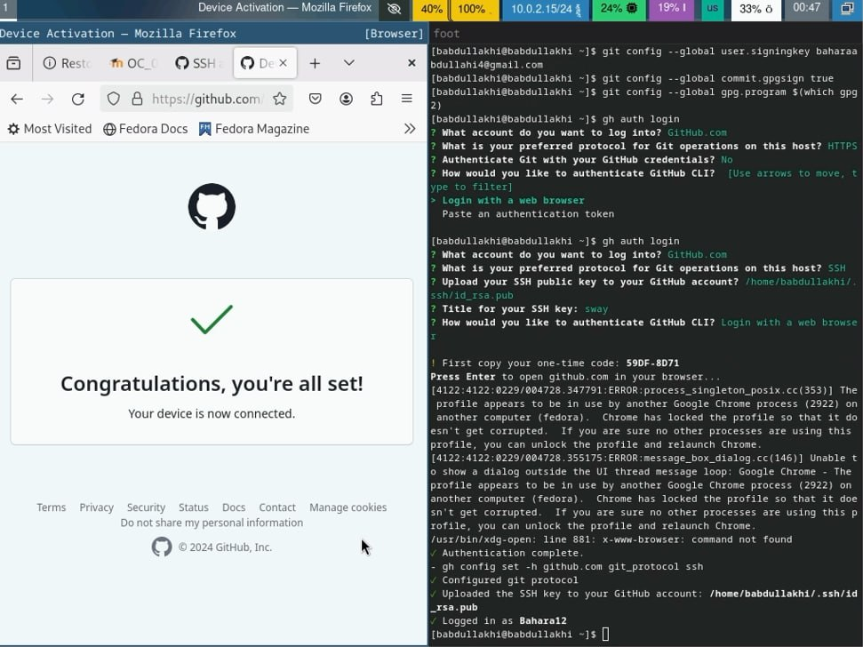{#fig:001 width=100%}

Шаблон для рабочего пространства
-Необходимо создать шаблон рабочего пространства (см. Рабочее пространство для лабораторной работы).

-Например, для 2022–2023 учебного года и предмета «Операционные системы» (код предмета os-intro) создание репозитория примет следующий вид:

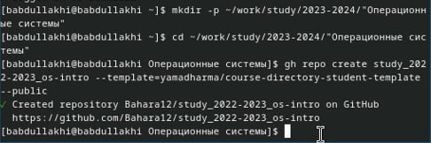{#fig:001 width=100%}
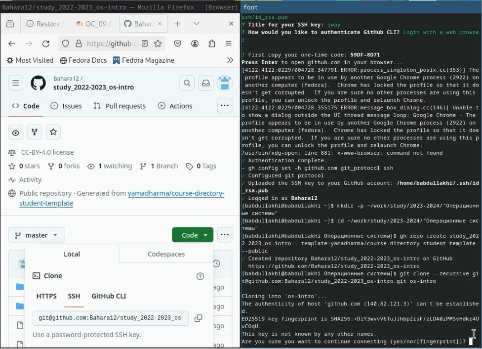{#fig:001 width=100%}

-
Настройка каталога курса. Перейдите в каталог курса:

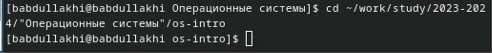{#fig:001 width=100%}

-
Удалите ненужные файлы и создайте необходимые каталоги:

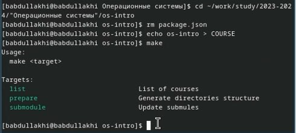{#fig:001 width=100%}

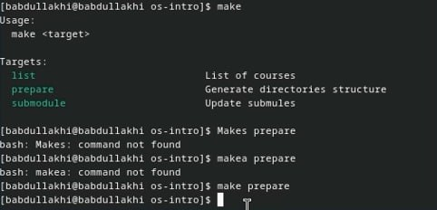{#fig:001 width=100%}

-Загрузить файлы на сервер.

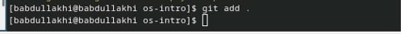{#fig:001 width=100%}
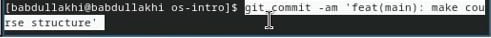{#fig:001 width=100%}
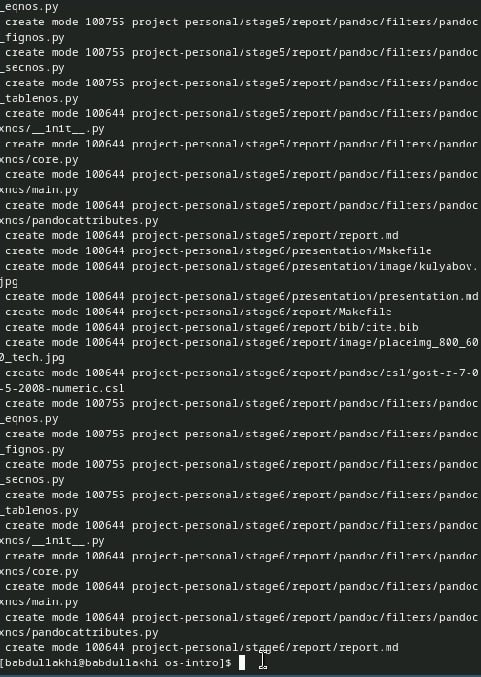{#fig:001 width=100%}
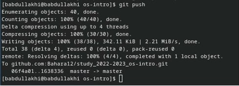{#fig:001 width=100%}

# Выводыh

Здесь кратко описываются итоги проделанной работы.

# Список литературы{.unnumbered}

::: {#refs}
:::
