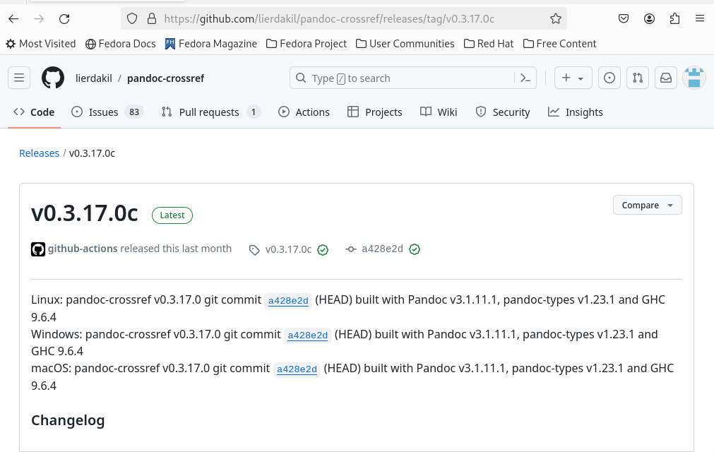
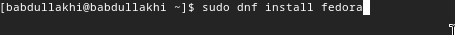
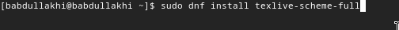
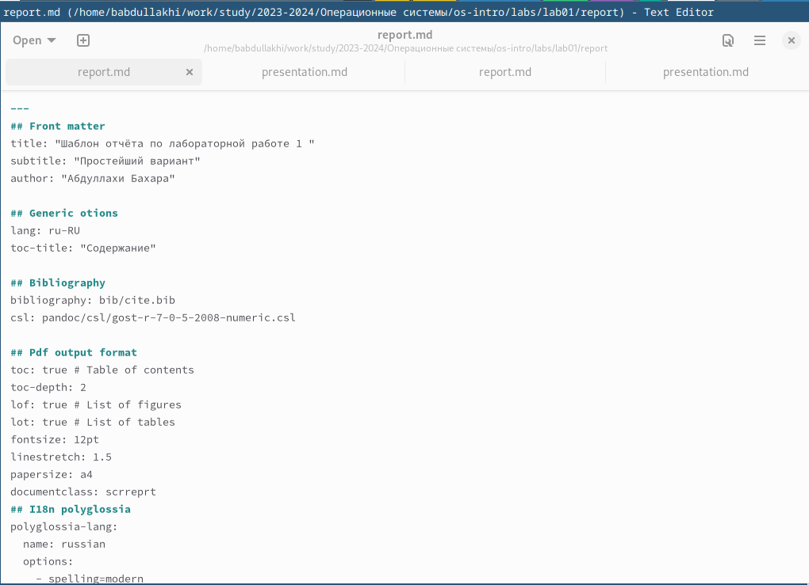
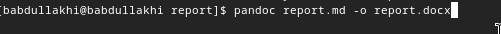
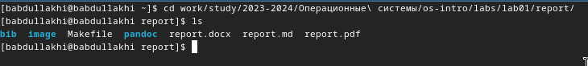
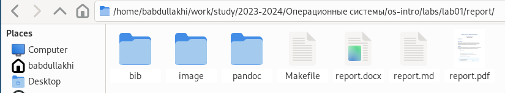

---
## Front matter
lang: ru-RU
title: лабораторной работе 3
author:
  - Абдуллахи Бахара 
institute:
  - Российский университет дружбы народов, Москва, Россия
  
date: 02 Мар 2024

## i18n babel
babel-lang: russian
babel-otherlangs: english

## Fonts
mainfont: PT Serif
romanfont: PT Serif
sansfont: PT Sans
monofont: PT Mono
mainfontoptions: Ligatures=TeX
romanfontoptions: Ligatures=TeX
sansfontoptions: Ligatures=TeX,Scale=MatchLowercase
monofontoptions: Scale=MatchLowercase,Scale=0.9
---

# Ход работы 

1- Для обработки файлов в Markdown вам необходимо скачать Pandoc и Pandoc-crossref.

{#fig:001 width=100%}

2-Скачать Пандок (Pandoc):

- Теперь вам нужно установить Pandoc, установить его можно командой: 
1) sudo dnf install pandoc 
2) sudo dnf install texlive-scheme-full

{#fig:001 width=100%}

3-Скачать Пандок (Pandoc)

{#fig:001 width=100%}

- установите pandoc,

4- теперь можно открыть Markdown и перезапустить создание лабораторного отчета.

{#fig:001 width=100%}

5- после окончания работы над Markdown нужно сменить тип файла на PDF и docx, для этого нужно зайти в каталог, в котором находится наш md файл.

{#fig:001 width=100%}

6- переход в каталог отчетов в терминале изменил внешний вид файла.

{#fig:001 width=100%}

7-конвертировать в PDF и docx.

{#fig:001 width=100%}

- проверка создания файла.

Выводы: 
Верез лaбораторной работы, мы научились оформлять отчёты с помощью легковесного языка Markdown.

# Спасибо за внимание !

