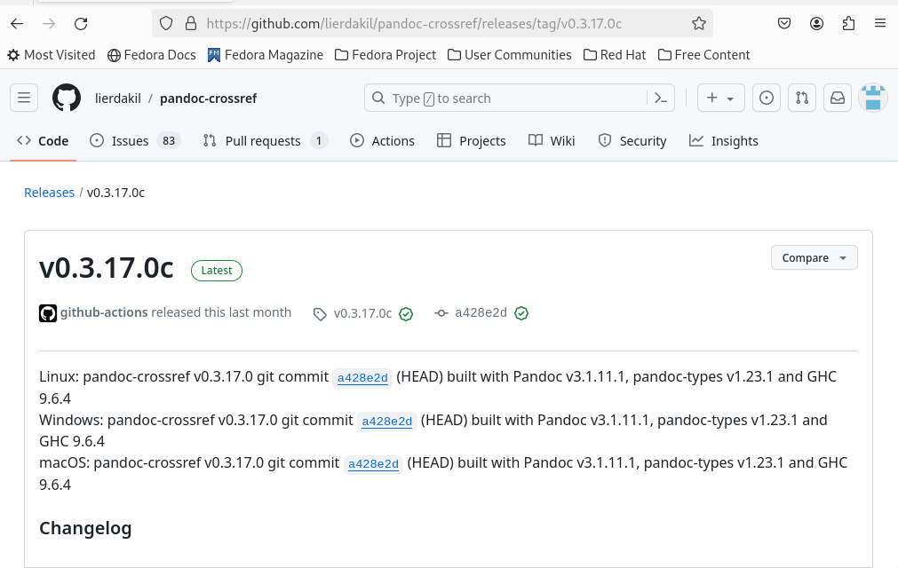
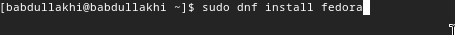
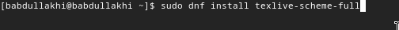
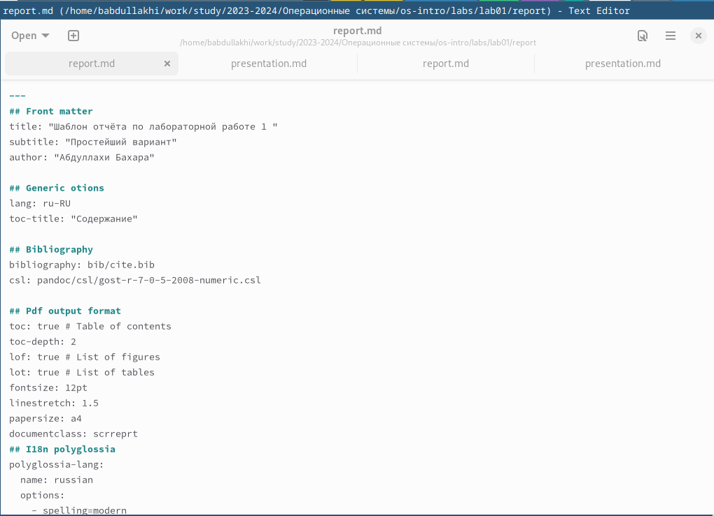
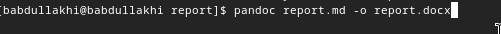
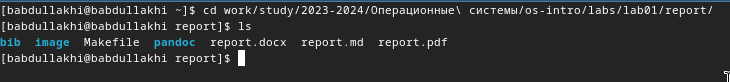
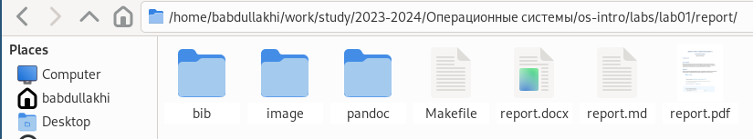

---
## Front matter
title: "Шаблон отчёта по лабораторной работе 3 "
subtitle: "Простейший вариант"
author: "Абдуллахи Бахара"

## Generic otions
lang: ru-RU
toc-title: "Содержание"

## Bibliography
bibliography: bib/cite.bib
csl: pandoc/csl/gost-r-7-0-5-2008-numeric.csl

## Pdf output format
toc: true # Table of contents
toc-depth: 2
lof: true # List of figures
lot: true # List of tables
fontsize: 12pt
linestretch: 1.5
papersize: a4
documentclass: scrreprt
## I18n polyglossia
polyglossia-lang:
  name: russian
  options:
	- spelling=modern
	- babelshorthands=true
polyglossia-otherlangs:
  name: english
## I18n babel
babel-lang: russian
babel-otherlangs: english
## Fonts
mainfont: PT Serif
romanfont: PT Serif
sansfont: PT Sans
monofont: PT Mono
mainfontoptions: Ligatures=TeX
romanfontoptions: Ligatures=TeX
sansfontoptions: Ligatures=TeX,Scale=MatchLowercase
monofontoptions: Scale=MatchLowercase,Scale=0.9
## Biblatex
biblatex: true
biblio-style: "gost-numeric"
biblatexoptions:
  - parentracker=true
  - backend=biber
  - hyperref=auto
  - language=auto
  - autolang=other*
  - citestyle=gost-numeric
## Pandoc-crossref LaTeX customization
figureTitle: "Рис."
tableTitle: "Таблица"
listingTitle: "Листинг"
lofTitle: "Список иллюстраций"
lotTitle: "Список таблиц"
lolTitle: "Листинги"
## Misc options
indent: true
header-includes:
  - \usepackage{indentfirst}
  - \usepackage{float} # keep figures where there are in the text
  - \floatplacement{figure}{H} # keep figures where there are in the text
---

# Цель работы
Научитесь создавать отчеты с использованием облегченного языка уценки Markdown.

# Задание
1- Сделать отчет по перцевой лаборатории в формате Markdown
2- В качестве отчета предоставляем отчеты в 3х форматах: pdf,docx и md(в архиве,так как там должны быть скриншоты,Markfile и т.д.

# Выполнение лабораторной работы :

1- Для обработки файлов в Markdown вам необходимо скачать Pandoc и Pandoc-crossref.

{#fig:001 width=100%}

2-Скачать Пандок (Pandoc):

- Теперь вам нужно установить Pandoc, установить его можно командой: 
1) sudo dnf install pandoc 
2) sudo dnf install texlive-scheme-full

{#fig:001 width=100%}

3-Скачать Пандок (Pandoc)

{#fig:001 width=100%}

- установите pandoc,

4- теперь можно открыть Markdown и перезапустить создание лабораторного отчета.

{#fig:001 width=100%}

5- после окончания работы над Markdown нужно сменить тип файла на PDF и docx, для этого нужно зайти в каталог, в котором находится наш md файл.

{#fig:001 width=100%}

6- переход в каталог отчетов в терминале изменил внешний вид файла.

{#fig:001 width=100%}

7-конвертировать в PDF и docx.

{#fig:001 width=100%}

- проверка создания файла.

Выводы: 
Верез лaбораторной работы, мы научились оформлять отчёты с помощью легковесного языка Markdown.

