---
## Front matter
lang: ru-RU
title: " Лабораторной работе 4 "
subtitle: "Продвинутое использование git"
author:
  - "Абдуллахи Бахара" 
institute:
  - Российский университет дружбы народов, Москва, Россия
  
date: 09 Мар 2024

## i18n babel
babel-lang: russian
babel-otherlangs: english

## Fonts
mainfont: PT Serif
romanfont: PT Serif
sansfont: PT Sans
monofont: PT Mono
mainfontoptions: Ligatures=TeX
romanfontoptions: Ligatures=TeX
sansfontoptions: Ligatures=TeX,Scale=MatchLowercase
monofontoptions: Scale=MatchLowercase,Scale=0.9

---

## Цель работы

- Получение навыков правильной работы с репозиториями git.

## Задание
- Выполнить работу для тестового репозитория.

- Преобразовать рабочий репозиторий в репозиторий с git-flow и conventional commits.

## Установка программного обеспечения

- Установка git-flow: ( dnf install gitflow)
- Установка Node.js : (dnf install nodejs)
- Настройка Node.js 

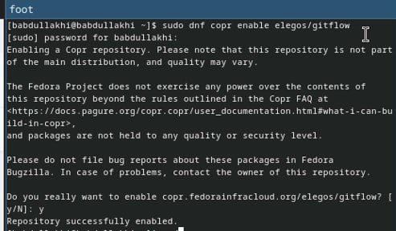
 
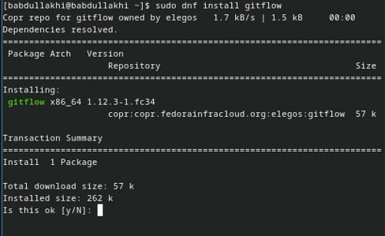

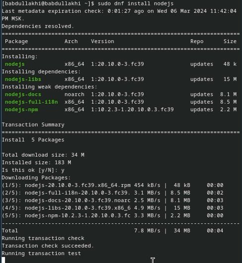

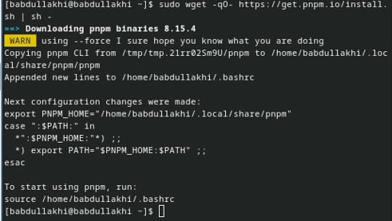

## Общепринятые коммиты:

1. commitizen
2. standard-changelog

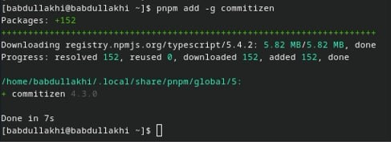

## Конфигурация общепринятых коммитов:

- Конфигурация для пакетов Node.js (pnpm init)

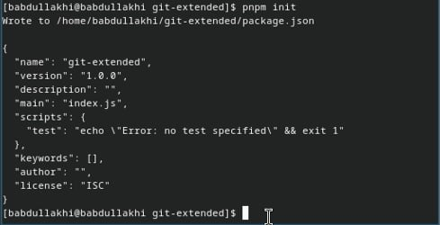

## Сконфигурим формат коммитов. Для этого добавим в файл package.json команду для формирования коммитов:

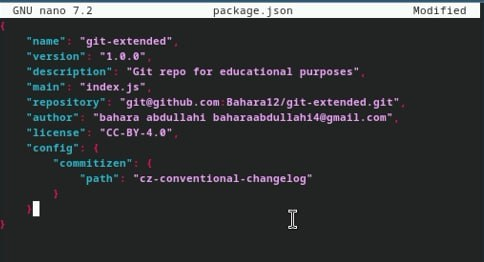

- Добавим новые файлы:

- Добавим новые файлы:

- Отправим на github:

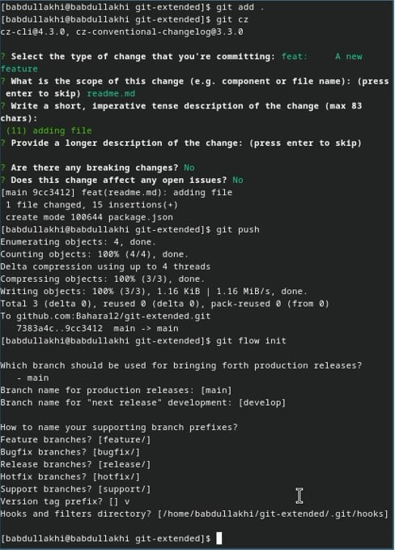

## Отправим на github:

- Отправим на github
- Префикс для ярлыков установим в v.
- Проверьте, что Вы на ветке develop: ( git branch )
- Загрузите весь репозиторий в хранилище:

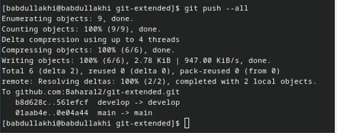
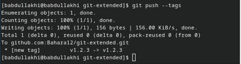

- Создадим релиз с версией 1.0.0
- Создадим журнал изменений
    - standard-changelog --first-release
    
- Добавим журнал изменений в индекс
   - git add CHANGELOG.md
  - git commit -am 'chore(site): add changelog'
  
- Зальём релизную ветку в основную ветку
  - git flow release finish 1.0.0
  
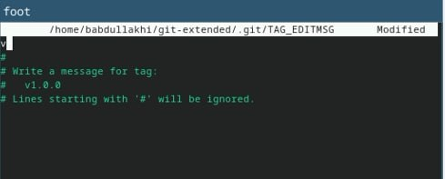

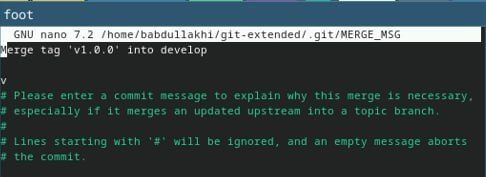

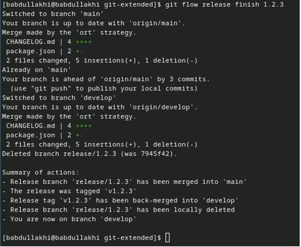

- Отправим данные на github
- Создадим релиз на github. Для этого будем использовать утилиты работы с github:

## Работа с репозиторием git:

  - Создадим ветку для новой функциональности:
  - Далее, продолжаем работу c git как обычно.
  - следует объединить ветку feature_branch c develop:
       - git flow feature finish feature_branch

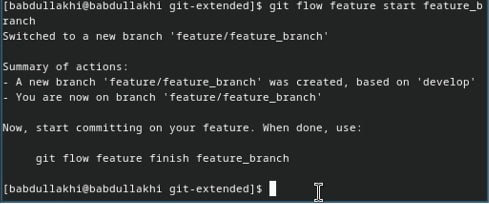

## Создание релиза git-flow:

- Создадим релиз с версией 1.2.3:
- Обновите номер версии в файле package.json. Установите её в 1.2.3.
- Создадим журнал изменений
    - standard-changelog
- Добавим журнал изменений в индекс
- git commit -am 'chore(site): update changelog'
- Зальём релизную ветку в основную ветку
    - git flow release finish 1.2.3
    
    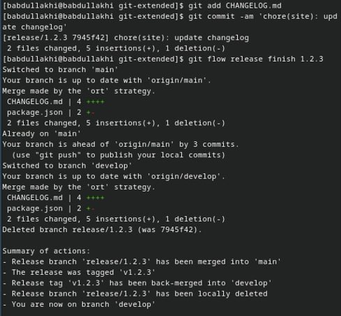

## Отправим данные на github:
- git push --all
- git push --tags
   - Создадим релиз на github с комментарием из журнала изменений:
   
   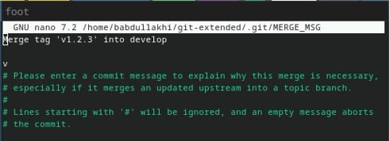
       
       
# Спасибо за винимание!

