---
## Front matter
title: "Шаблон отчёта по лабораторной работе 4 "
subtitle: "Продвинутое использование git"
author: "Абдуллахи Бахара"

---
}

# Цель работы
- Получение навыков правильной работы с репозиториями git.

# Задание

- Выполнить работу для тестового репозитория.

- Преобразовать рабочий репозиторий в репозиторий с git-flow и conventional commits.

# Выполнение лабораторной работы:

## Установка программного обеспечения

- Установка git-flow:
- Linux
- Fedora
- Установка из коллекции репозиториев Copr (https://copr.fedorainfracloud.org/coprs/elegos/gitflow/):

 # Enable the copr repository
 dnf copr enable elegos/gitflow
 # Install gitflow
 dnf install gitflow

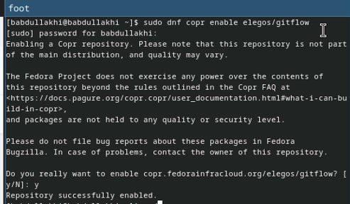{#fig:001 width=100%}

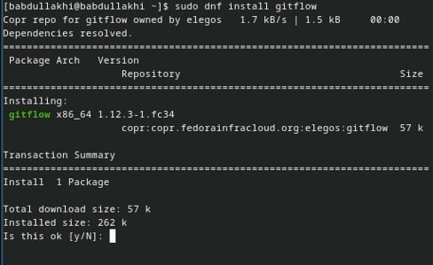{#fig:001 width=100%}

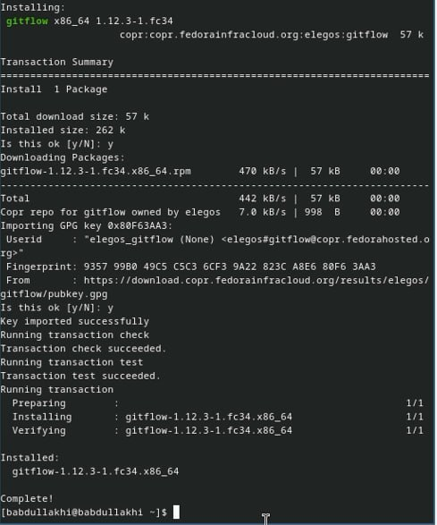{#fig:001 width=100%}

Установка Node.js :

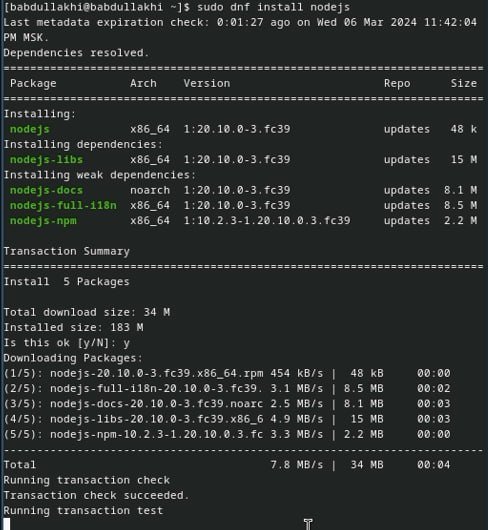{#fig:001 width=100%}

- Чтобы установить apt-get install pnpm, нужно установить apt с помощью этого камнда dnf install apt:

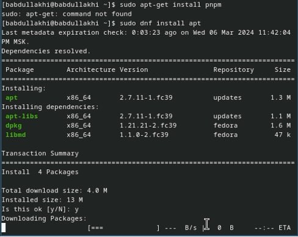{#fig:001 width=100%}

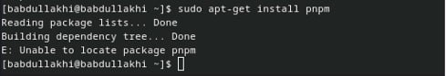{#fig:001 width=100%}

# Настройка Node.js:

- Для работы с Node.js добавим каталог с исполняемыми файлами, устанавливаемыми yarn, в переменную PATH.

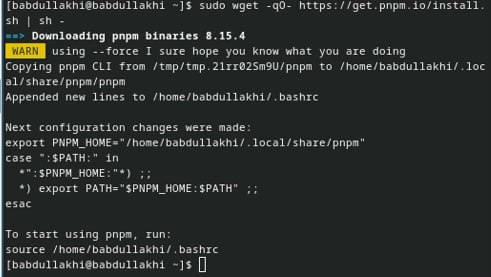{#fig:001 width=100%}

- Запустите:
- Перелогиньтесь, или выполните:

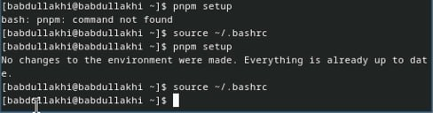{#fig:001 width=100%}

# Общепринятые коммиты: 
- commitizen:

- Данная программа используется для помощи в форматировании коммитов.

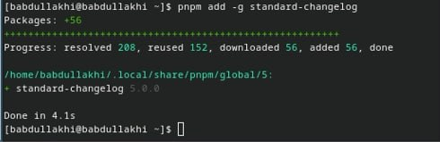{#fig:001 width=100%}

- При этом устанавливается скрипт git-cz, который мы и будем использовать для коммитов.

- standard-changelog:

- Данная программа используется для помощи в создании логов.

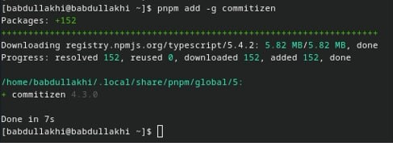{#fig:001 width=100%}

- Практический сценарий использования git:

1) Подключение репозитория к github

- Создайте репозиторий на GitHub. Для примера назовём его git-extended.

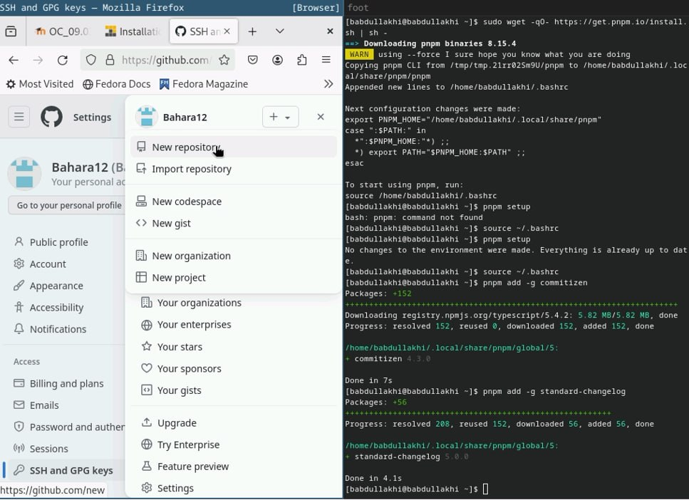{#fig:001 width=100%}
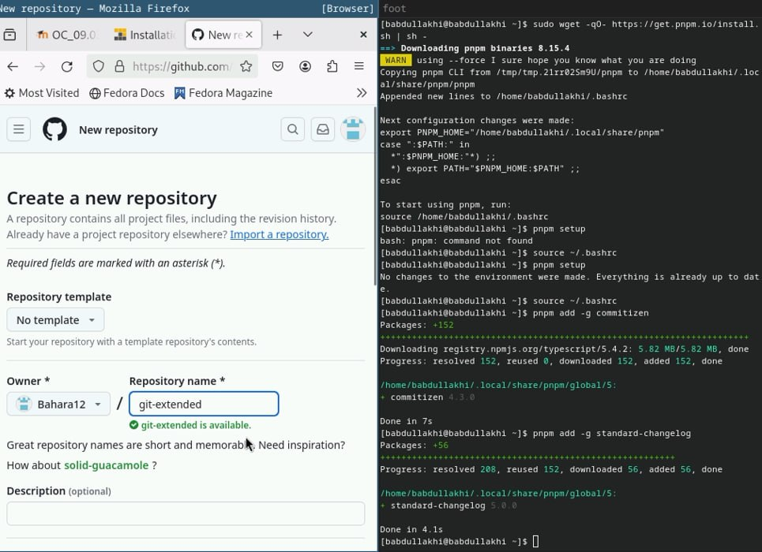{#fig:001 width=100%}
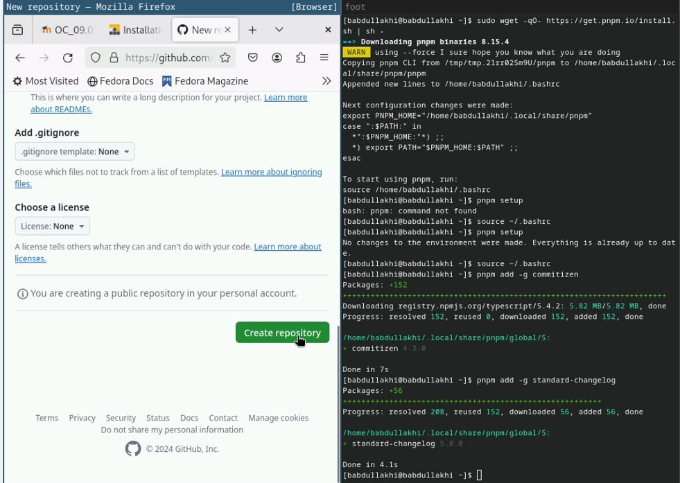{#fig:001 width=100%}
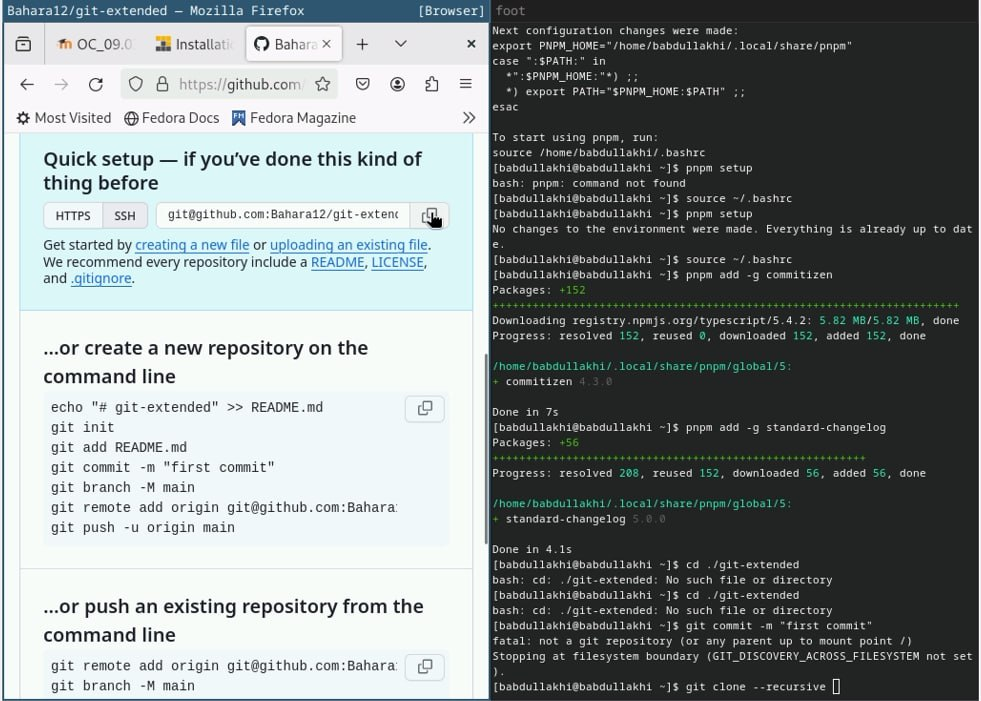{#fig:001 width=100%}

# Делаем первый коммит и выкладываем на github:

- Сначала мы входим в файл git-extended, затем создадим файл README.md, открываем там README.md, потом с помощью nano там напишим README.md после этого начинаем коммитить на github:

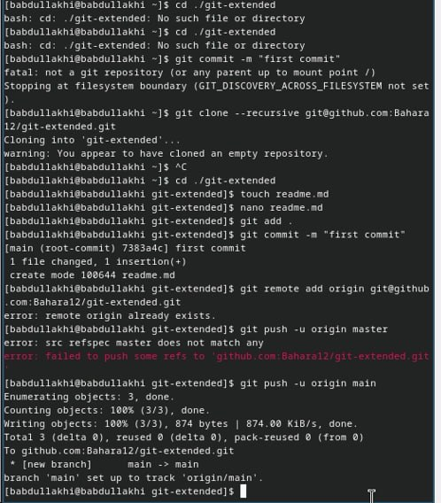{#fig:001 width=100%}

# Конфигурация общепринятых коммитов:
- Конфигурация для пакетов Node.js

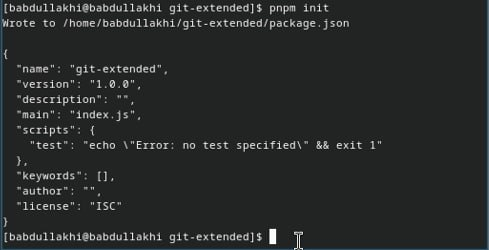{#fig:001 width=100%}

- Сконфигурим формат коммитов. Для этого добавим в файл package.json команду для формирования коммитов:

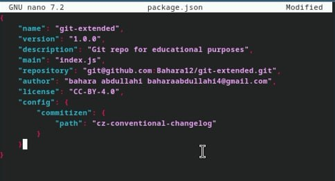{#fig:001 width=100%}

- добавим новые файлы, зафиксируем их и отправим на Gthub:

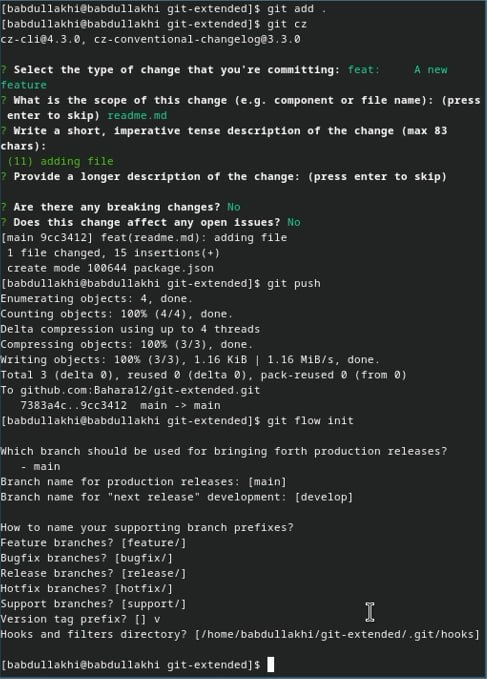{#fig:001 width=100%}

# Конфигурация git-flow: 

- мы инициализируем git-flow  и устанавливаем префикс для ярлыков v.

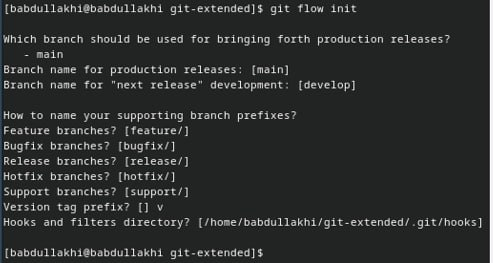{#fig:001 width=100%}

- Проверьте, что Вы на ветке develop:
- Загрузите весь репозиторий в хранилище:

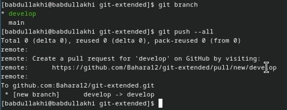{#fig:001 width=100%}

- Установите внешнюю ветку как вышестоящую для этой ветки:

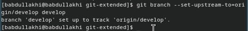{#fig:001 width=100%}

- Создадим релиз с версией 1.0.0

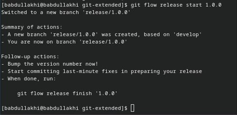{#fig:001 width=100%}

- Создадим журнал изменений

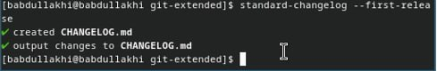{#fig:001 width=100%}

- Добавим журнал изменений в индекс:

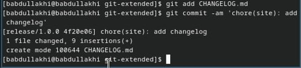{#fig:001 width=100%}
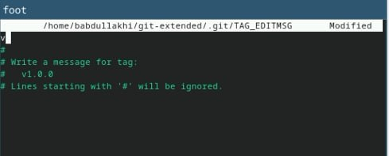{#fig:001 width=100%}
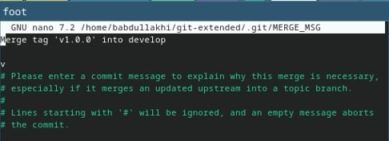{#fig:001 width=100%}

- Зальём релизную ветку в основную ветку:

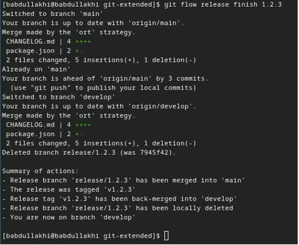{#fig:001 width=100%}

- Отправим данные на github:

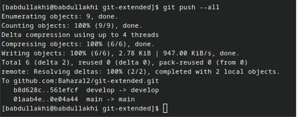{#fig:001 width=100%}

- Создадим релиз на github. Для этого будем использовать утилиты работы с github:

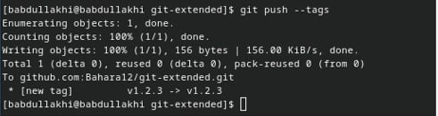{#fig:001 width=100%}

# Работа с репозиторием git:

-  Разработка новой функциональности:

- Создадим ветку для новой функциональности:

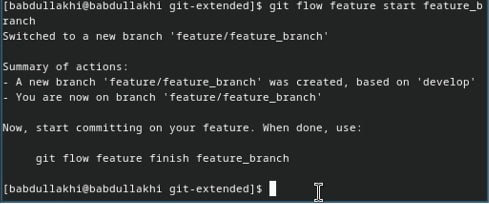{#fig:001 width=100%}

- следует объединить ветку:

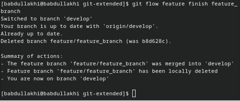{#fig:001 width=100%}

- Создание релиза git-flow:
- Создадим релиз с версией 1.2.3:

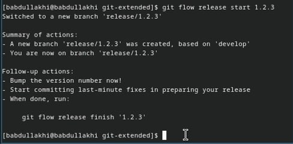{#fig:001 width=100%}

- Обновите номер версии в файле package.json.

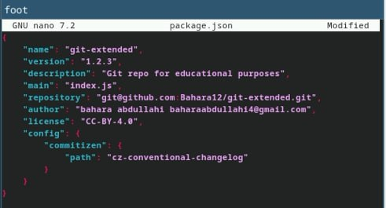{#fig:001 width=100%}

- Создадим журнал изменений

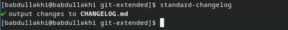{#fig:001 width=100%}

- Добавим журнал изменений в индекс
- Зальём релизную ветку в основную ветку

 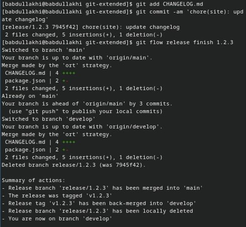{#fig:001 width=100%}
 
 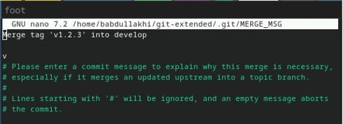{#fig:001 width=100%}
 
 - Отправим данные на github 
 
 - Создадим релиз на github с комментарием из журнала изменений: 
  
  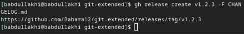{#fig:001 width=100%}
  

# Выводы:

- Получение навыков правильной работы с репозиториями git.

