---
## Front matter
lang: ru-RU
title: " Лабораторной работе 5 "

author:
  - Абдуллахи Бахара
institute:
  - Российский университет дружбы народов, Москва, Россия
  
date: 15 Мар 2024

## i18n babel
babel-lang: russian
babel-otherlangs: english

## Fonts
mainfont: PT Serif
romanfont: PT Serif
sansfont: PT Sans
monofont: PT Mono
mainfontoptions: Ligatures=TeX
romanfontoptions: Ligatures=TeX
sansfontoptions: Ligatures=TeX,Scale=MatchLowercase
monofontoptions: Scale=MatchLowercase,Scale=0.9

---

## Выполнение лабораторной работы
## Менеджер паролей pass:
- Установка
- pass  ,   dnf install pass pass-otp
- gopass     ,  dnf install gopass

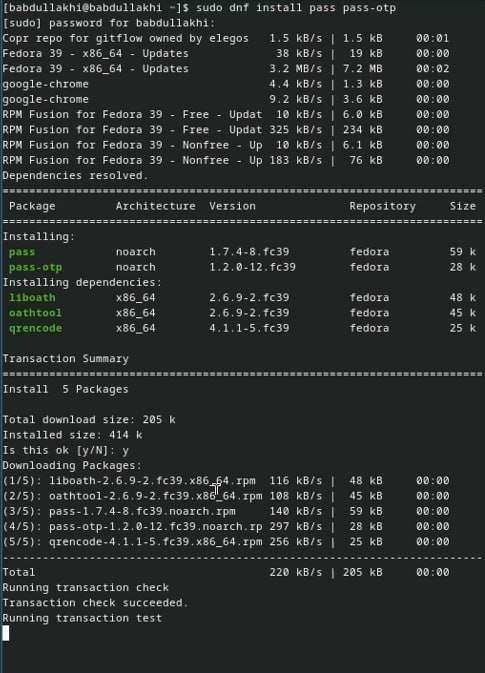

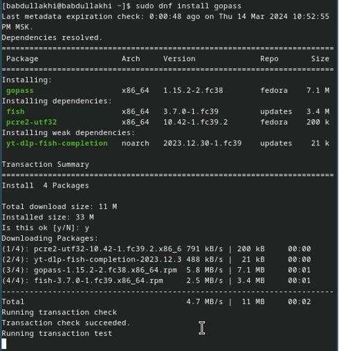

## Настройка:
- Ключи GPG 

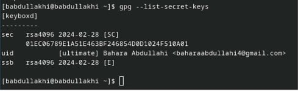

## Инициализация хранилища: 

- Инициализируем хранилище: pass init <gpg-id or email>

## Синхронизация с git:
- Создадим структуру git:

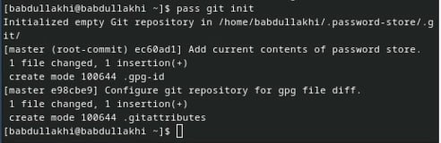

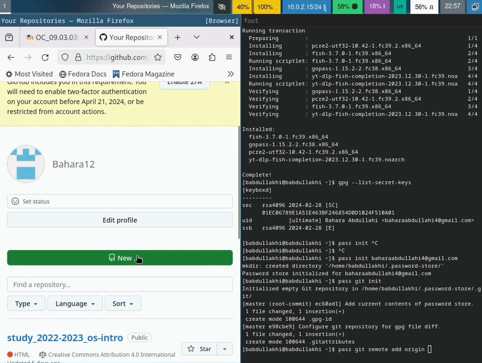

- pass git init:

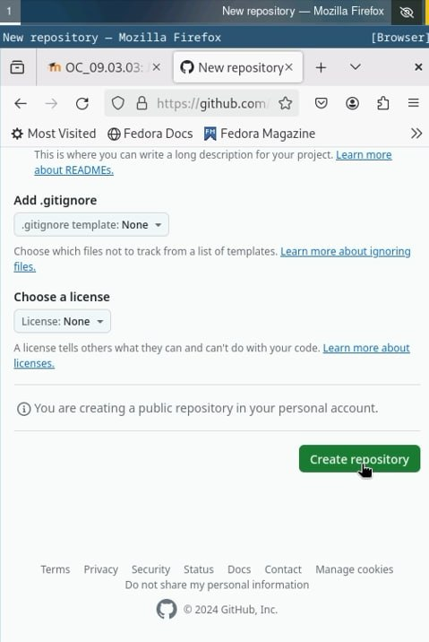

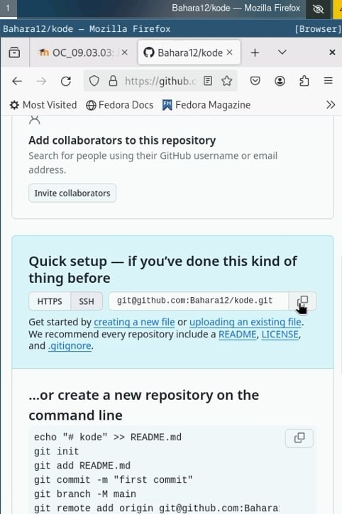

- Для синхронизации выполняется следующая команда:

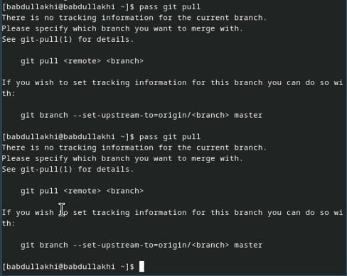

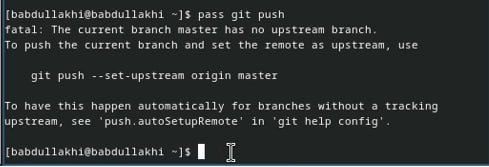

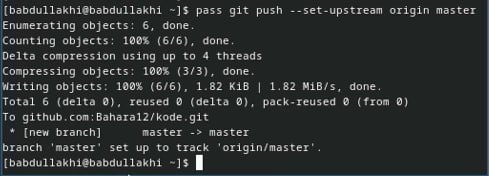

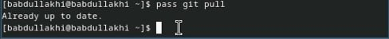

## Прямые изменения: 
 - Следует заметить, что отслеживаются только изменения, сделанные через сам gopass (или pass).
 
 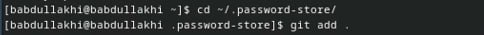
 
 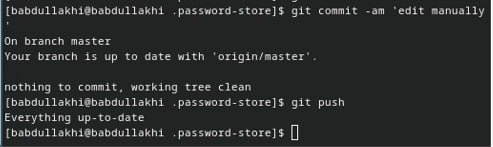
 
## Настройка интерфейса с броузером:
- Для взаимодействия с броузером используется интерфейс native messaging.

- Плагин browserpass: Плагин для Firefox: https://addons.mozilla.org/en-US/firefox/addon/browserpass-ce/.

 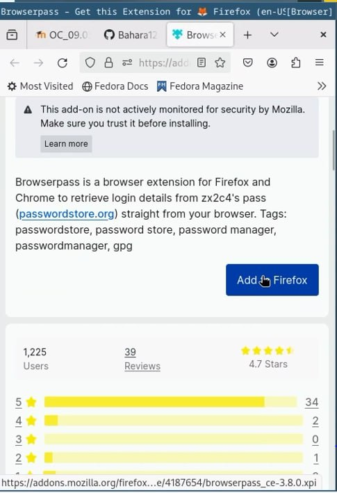
 
 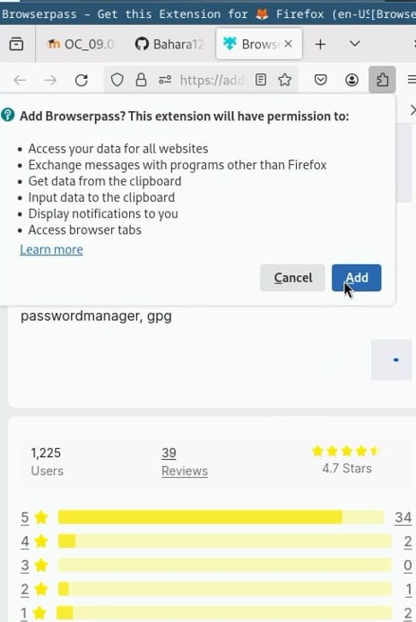
 
## Fedora: 
- dnf copr enable maximbaz/browserpass
- dnf install browserpass
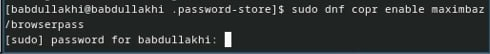

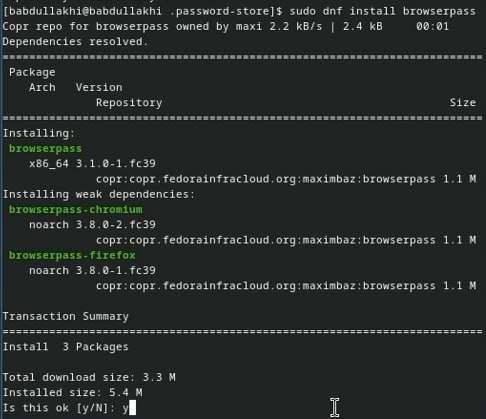
 
## Сохранение пароля:
- Добавить новый файла; 
- touch pass.txt

 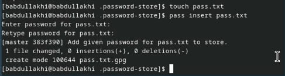

- pass insert [OPTIONAL DIR]/[FILENAME]

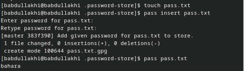
 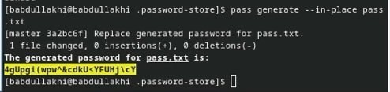
 
 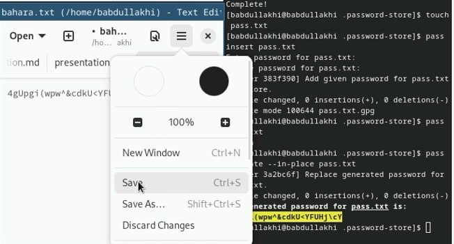
 
## Управление файлами конфигурации:

- Дополнительное программное обеспечение;
- Установите дополнительное программное обеспечение:

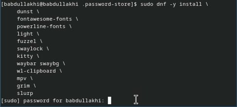

## установите шрифты:
- sudo dnf copr enable peterwu/iosevka

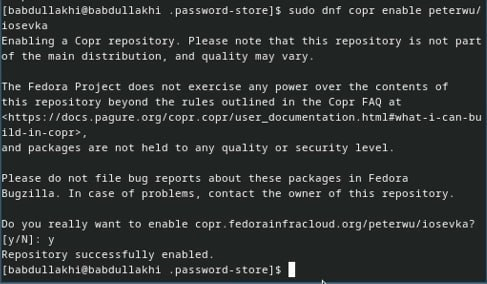
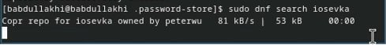

## Установка:
- Установка бинарного файла. Скрипт определяет архитектуру процессора и операционную систему и скачивает необходимый файл:

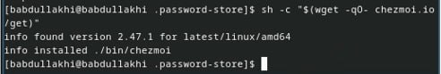

## Создание собственного репозитория с помощью утилит:

- Будем использовать утилиты командной строки для работы с github.

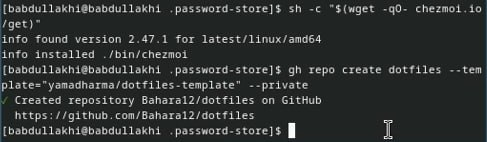

## Подключение репозитория к своей системе:
- копиравала chezmoi с помощью этого команда :
- sudo cp ./bin/chezmoi /usr/local/bin

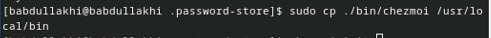

## Инициализируйте chezmoi с вашим репозиторием dotfiles:
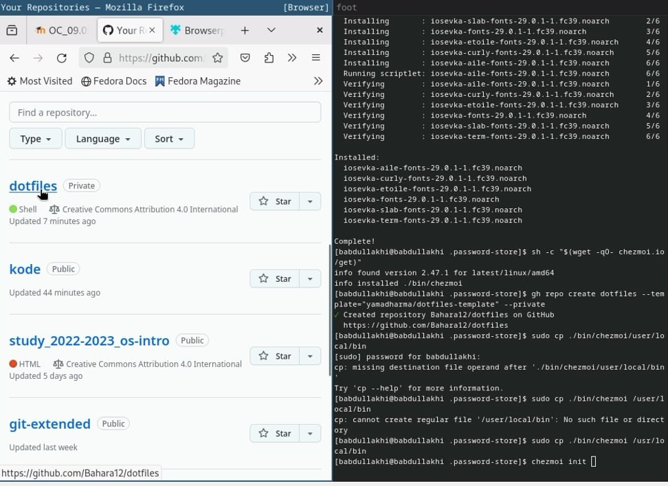

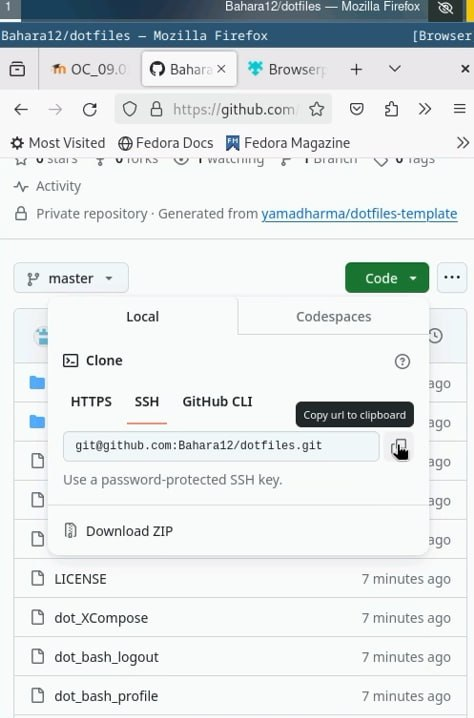

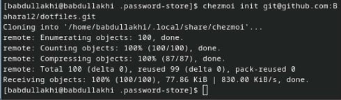

- Проверьте, какие изменения внесёт chezmoi в домашний каталог, запустив:
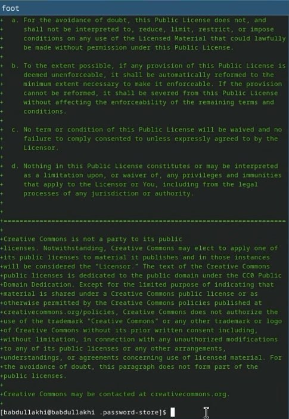

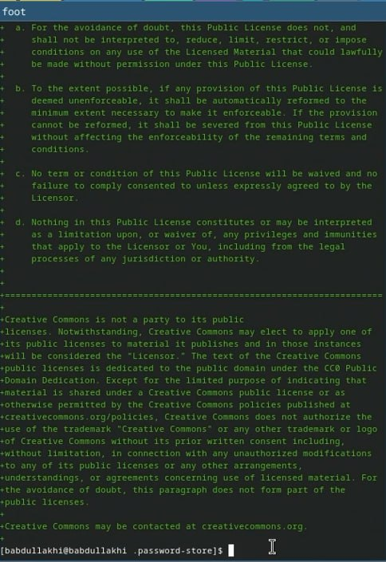

## Использование chezmoi на нескольких машинах:
- Установка;
- Установка бинарного файла. Скрипт определяет архитектуру процессора и операционную систему и скачивает необходимый файл:
- с помощью wget:   sh -c "$(wget -qO- chezmoi.io/get)"

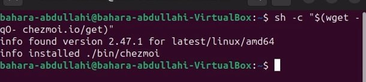

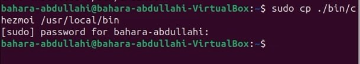

- копиравала chezmoi с помощью этого команда в ubuntu :

- sudo cp ./bin/chezmoi /usr/local/bin
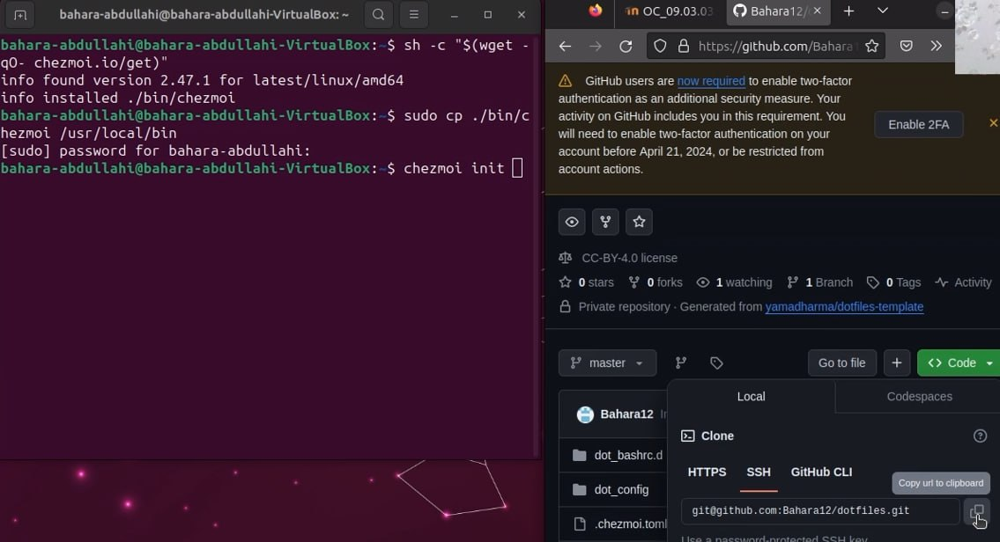

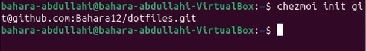

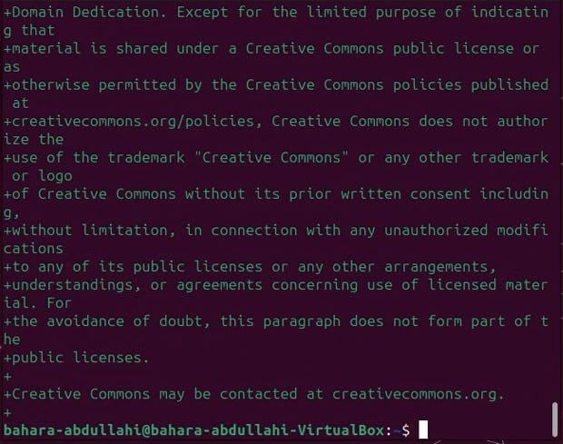

## Настройка новой машины с помощью одной команды:
- Ежедневные операции c chezmoi:

 - Извлеките последние изменения из репозитория и примените их
 - Можно извлечь изменения из репозитория и применить их одной командой:
 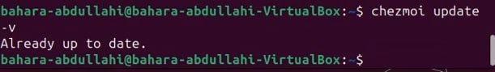
 
 - Извлеките последние изменения из своего репозитория и посмотрите, что изменится, фактически не применяя изменения:
 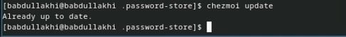
 
 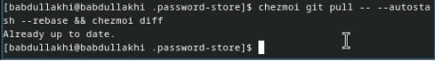
 
- Это запускается git pull --autostash --rebase в вашем исходном каталоге, а chezmoi diff затем показывает разницу между целевым состоянием, вычисленным из вашего исходного каталога, и фактическим состоянием.

- Если вы довольны изменениями, вы можете применить их:

 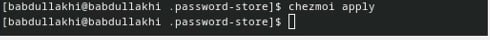
 
## Автоматически фиксируйте и отправляйте изменения в репозиторий:

- Можно автоматически фиксировать и отправлять изменения в исходный каталог в репозиторий.
 
- Чтобы включить её, добавьте в файл конфигурации ~/.config/chezmoi/chezmoi.toml следующее:
- ~/.config/chezmoi/chezmoi.toml следующее:

 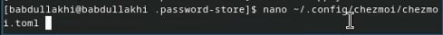
 
 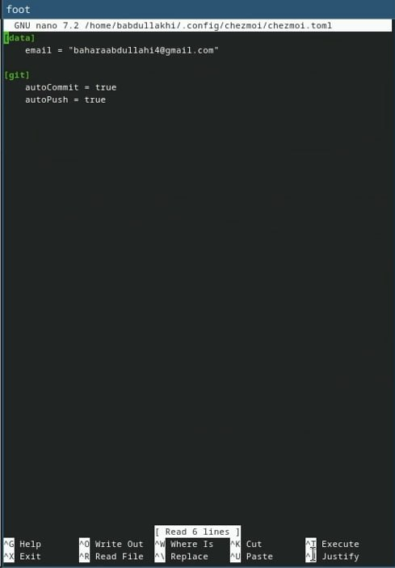
  
  

#  Спасибо за винимание!

