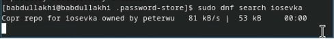
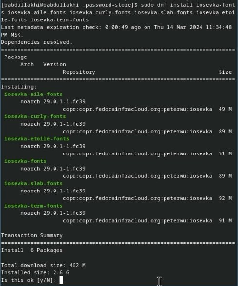

---
## Front matter
title: "Шаблон отчёта по лабораторной работе 5"
subtitle: "Простейший вариант"
author: "Абдуллахи Бахара"

## Generic otions
lang: ru-RU
toc-title: "Содержание"

## Bibliography
bibliography: bib/cite.bib
csl: pandoc/csl/gost-r-7-0-5-2008-numeric.csl

## Pdf output format
toc: true # Table of contents
toc-depth: 2
lof: true # List of figures
lot: true # List of tables
fontsize: 12pt
linestretch: 1.5
papersize: a4
documentclass: scrreprt
## I18n polyglossia
polyglossia-lang:
  name: russian
  options:
	- spelling=modern
	- babelshorthands=true
polyglossia-otherlangs:
  name: english
## I18n babel
babel-lang: russian
babel-otherlangs: english
## Fonts
mainfont: PT Serif
romanfont: PT Serif
sansfont: PT Sans
monofont: PT Mono
mainfontoptions: Ligatures=TeX
romanfontoptions: Ligatures=TeX
sansfontoptions: Ligatures=TeX,Scale=MatchLowercase
monofontoptions: Scale=MatchLowercase,Scale=0.9
## Biblatex
biblatex: true
biblio-style: "gost-numeric"
biblatexoptions:
  - parentracker=true
  - backend=biber
  - hyperref=auto
  - language=auto
  - autolang=other*
  - citestyle=gost-numeric
  ## Pandoc-crossref LaTeX customization
figureTitle: "Рис."
tableTitle: "Таблица"
listingTitle: "Листинг"
lofTitle: "Список иллюстраций"
lotTitle: "Список таблиц"
lolTitle: "Листинги"
## Misc options
indent: true
header-includes:
  - \usepackage{indentfirst}
  - \usepackage{float} # keep figures where there are in the text
  - \floatplacement{figure}{H} # keep figures where there are in the text

---

# Выполнение лабораторной работы

- Менеджер паролей pass:
- Установка
- pass  ,   dnf install pass pass-otp
- gopass     ,  dnf install gopass

{#fig:001 width=100%}

{#fig:001 width=100%}

## Настройка:
- Ключи GPG : Просмотр списка ключей

{#fig:001 width=100%}

# Инициализация хранилища: 
- Инициализируем хранилище: pass init <gpg-id or email>

{#fig:001 width=100%}

# Синхронизация с git:

- Создадим структуру git:

- pass git init:

{#fig:001 width=100%}

{#fig:001 width=100%}

{#fig:001 width=100%}

{#fig:001 width=100%}

- Также можно задать адрес репозитория на хостинге (репозиторий необходимо предварительно создать)

{#fig:001 width=100%}

- Для синхронизации выполняется следующая команда:

- pass git pull

{#fig:001 width=100%}

{#fig:001 width=100%}

- pass git push

{#fig:001 width=100%}

{#fig:001 width=100%

## Прямые изменения: 
- Следует заметить, что отслеживаются только изменения, сделанные через сам gopass (или pass).

{#fig:001 width=100%

{#fig:001 width=100%

## Настройка интерфейса с броузером:

- Для взаимодействия с броузером используется интерфейс native messaging.

- Плагин browserpass: Плагин для Firefox: https://addons.mozilla.org/en-US/firefox/addon/browserpass-ce/.

{#fig:001 width=100%

{#fig:001 width=100%

- Fedora: 
- dnf copr enable maximbaz/browserpass
- dnf install browserpass

{#fig:001 width=100%

{#fig:001 width=100%

## Сохранение пароля:
- Добавить новый файла; 
- touch pass.txt 

{#fig:001 width=100%
- Добавить новый пароль

- pass insert [OPTIONAL DIR]/[FILENAME]

{#fig:001 width=100%

- Отобразите пароль для указанного имени файла:
- Замените существующий пароль:

{#fig:001 width=100%
{#fig:001 width=100%
{#fig:001 width=100%

## Управление файлами конфигурации:
- Дополнительное программное обеспечение;
- Установите дополнительное программное обеспечение:

{#fig:001 width=100%

- установите шрифты:
- sudo dnf copr enable peterwu/iosevka

{#fig:001 width=100%
{#fig:001 width=100%
{#fig:001 width=100%

## Установка:
- Установка бинарного файла. Скрипт определяет архитектуру процессора и операционную систему и скачивает необходимый файл:
- с помощью wget:

{#fig:001 width=100%

## Создание собственного репозитория с помощью утилит:
- Будем использовать утилиты командной строки для работы с github.
- Создадим свой репозиторий для конфигурационных файлов на основе шаблона:

{#fig:001 width=100%

## Подключение репозитория к своей системе:
- копиравала chezmoi с помощью этого команда :sudo cp ./bin/chezmoi /usr/local/bin

{#fig:001 width=100%

- Инициализируйте chezmoi с вашим репозиторием dotfiles:

{#fig:001 width=100%

{#fig:001 width=100%

{#fig:001 width=100%

- Проверьте, какие изменения внесёт chezmoi в домашний каталог, запустив:

{#fig:001 width=100%

- Если вас устраивают изменения, внесённые chezmoi, запустите:
 
 {#fig:001 width=100%
 
## Использование chezmoi на нескольких машинах:
-Установка;
- Установка бинарного файла. Скрипт определяет архитектуру процессора и операционную систему и скачивает необходимый файл:

- с помощью wget:   sh -c "$(wget -qO- chezmoi.io/get)"

{#fig:001 width=100%
{#fig:001 width=100%
 
- На второй машине инициализируйте chezmoi с вашим репозиторием dotfiles:

- копиравала chezmoi с помощью этого команда в ubuntu :sudo cp ./bin/chezmoi /usr/local/bin

{#fig:001 width=100%
 
{#fig:001 width=100%
 
{#fig:001 width=100%
 
 - При существующем каталоге chezmoi можно получить и применить последние изменения из вашего репозитория:
 
 {#fig:001 width=100%
 
## Настройка новой машины с помощью одной команды:
 
# Ежедневные операции c chezmoi:
 - Извлеките последние изменения из репозитория и примените их
 - Можно извлечь изменения из репозитория и применить их одной командой:
 
{#fig:001 width=100%

- Извлеките последние изменения из своего репозитория и посмотрите, что изменится, фактически не применяя изменения:

{#fig:001 width=100%
{#fig:001 width=100%

- Это запускается git pull --autostash --rebase в вашем исходном каталоге, а chezmoi diff затем показывает разницу между целевым состоянием, вычисленным из вашего исходного каталога, и фактическим состоянием.
- Если вы довольны изменениями, вы можете применить их:

{#fig:001 width=100%
 
# Автоматически фиксируйте и отправляйте изменения в репозиторий;

- Можно автоматически фиксировать и отправлять изменения в исходный каталог в репозиторий.
 
- Чтобы включить её, добавьте в файл конфигурации ~/.config/chezmoi/chezmoi.toml следующее:

[git]
    autoCommit = true
    autoPush = true
    
- ~/.config/chezmoi/chezmoi.toml следующее:

{#fig:001 width=100%

{#fig:001 width=100%

