---
## Front matter
lang: ru-RU
title: " Лабораторной работе 6 "
author:
  - "Абдуллахи Бахара"
institute:
  
  - Объединённый институт ядерных исследований, Дубна, Россия
date: 16 Мар 2024

## i18n babel
babel-lang: russian
babel-otherlangs: english

## Fonts
mainfont: PT Serif
romanfont: PT Serif
sansfont: PT Sans
monofont: PT Mono
mainfontoptions: Ligatures=TeX
romanfontoptions: Ligatures=TeX
sansfontoptions: Ligatures=TeX,Scale=MatchLowercase
monofontoptions: Scale=MatchLowercase,Scale=0.9

## Formatting pdf
toc: false
toc-title: Содержание
slide_level: 2
aspectratio: 169
section-titles: true
theme: metropolis
header-includes:
 - \metroset{progressbar=frametitle,sectionpage=progressbar,numbering=fraction}
 - '\makeatletter'
 - '\beamer@ignorenonframefalse'
 - '\makeatother'
 
---

## Цель работы

- Приобретение практических навыков взаимодействия пользователя с системой по-
средством командной строки.

## Последовательность выполнения работы:

- 1. Определите полное имя вашего домашнего каталога. Далее относительно этого ката-
лога будут выполняться последующие упражнения.

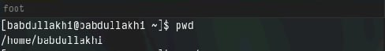

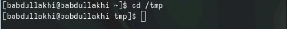

##  Выполните следующие действия:
- Перейдите в каталог /tmp.
- Выведите на экран содержимое каталога /tmp. Для этого используйте команду ls
с различными опциями. Поясните разницу в выводимой на экран информации

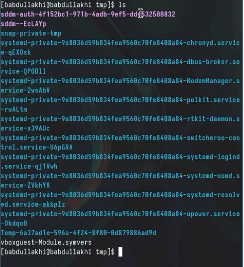

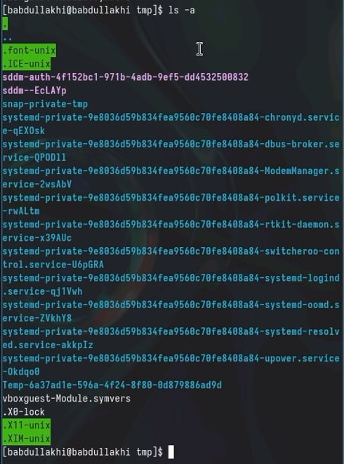

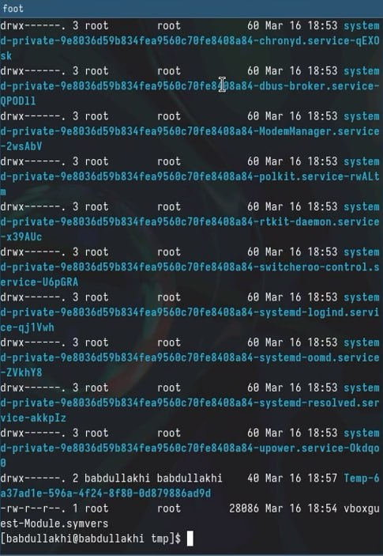

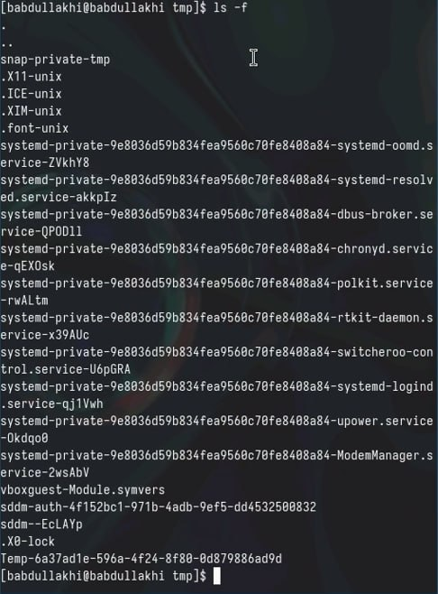

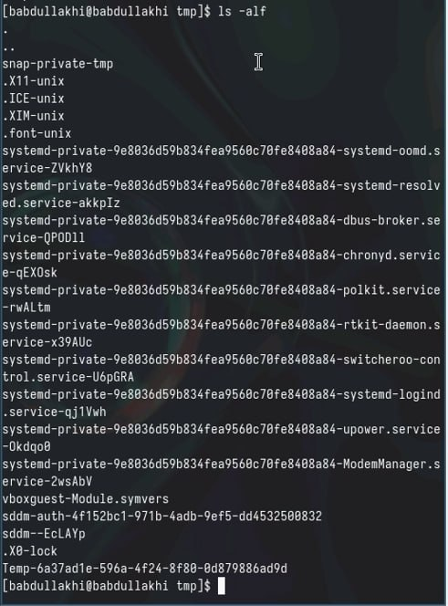

- - Определите, есть ли в каталоге /var/spool подкаталог с именем cron?

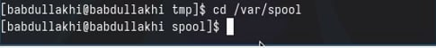

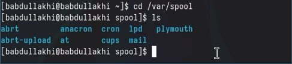

## Выполните следующие действия:
- В домашнем каталоге создайте новый каталог с именем newdir.

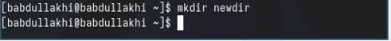

- В каталоге ~/newdir создайте новый каталог с именем morefun.

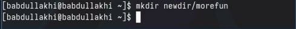

- В домашнем каталоге создайте одной командой три новых каталога с именами
letters, memos, misk. Затем удалите эти каталоги одной командой.

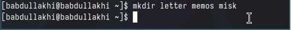

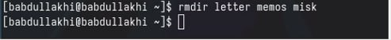

- Удалите каталог ~/newdir/morefun из домашнего каталога. Проверьте, был ли
каталог удалён.

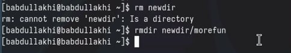

## С помощью команды man определите, какую опцию команды ls нужно 
- использо-вать для просмотра содержимое не только указанного каталога, но и подкаталогов,
входящих в него.

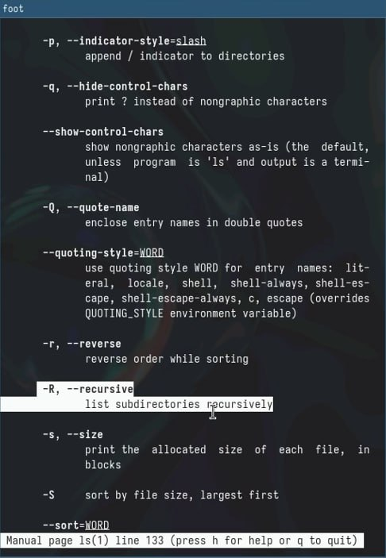

## С помощью команды man определите набор опций команды ls, 
- позволяющий отсорти- ровать по времени последнего изменения выводимый список содержимого каталога
с развёрнутым описанием файлов.

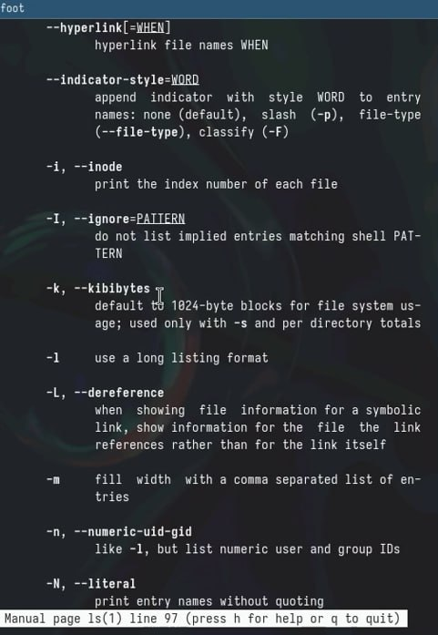

## Используйте команду man для просмотра описания следующих команд: cd, pwd, mkdir,rmdir, rm. 
- Поясните основные опции этих команд.

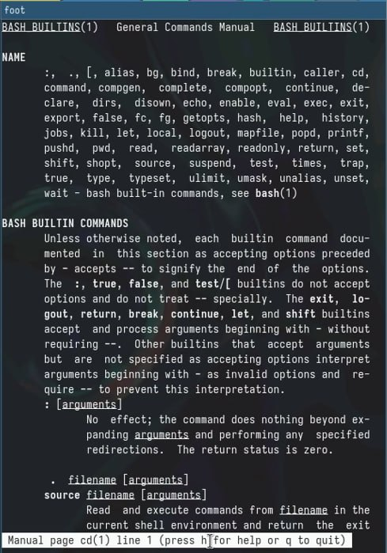

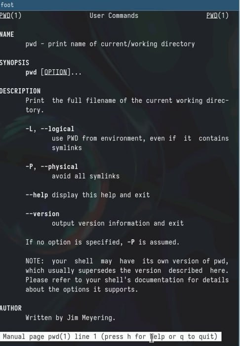

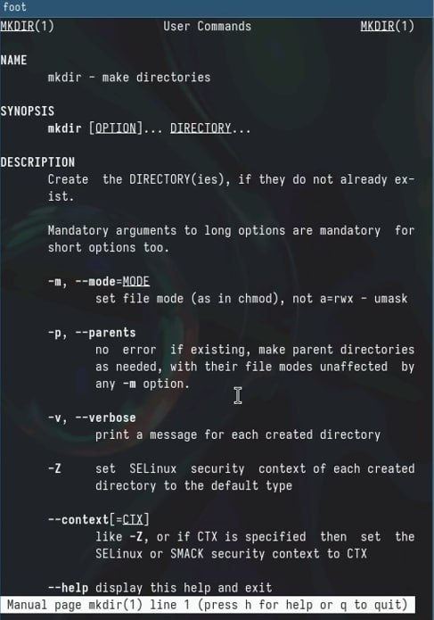

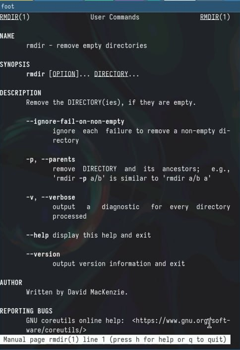

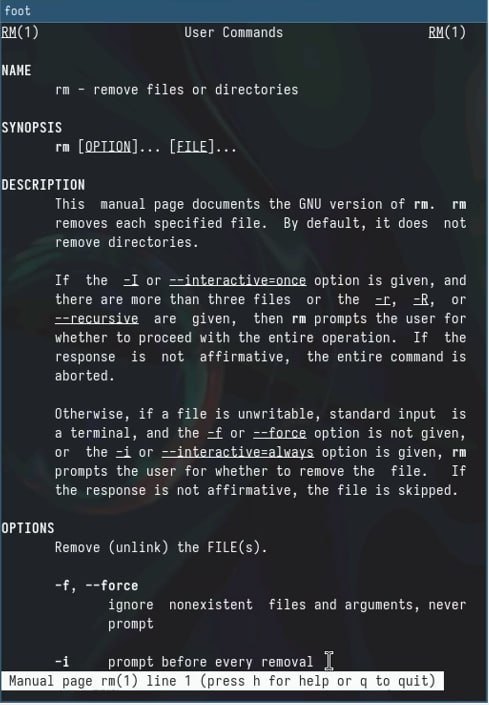

## Используя информацию, полученную при помощи команды history, 
- выполните мо-дификацию и исполнение нескольких команд из буфера команд.

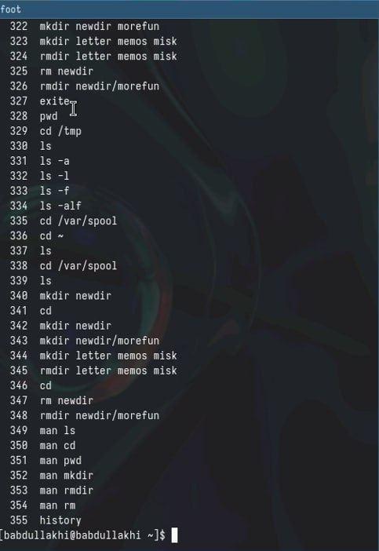

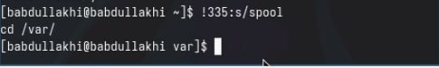

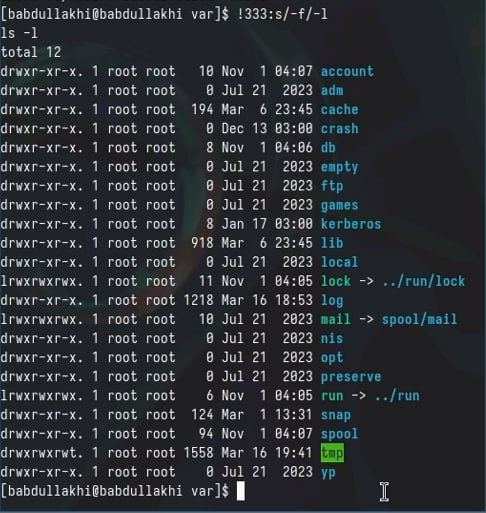

# Спасибо за винимание!
