---
## Front matter
title: "Шаблон отчёта по лабораторной работе 7 "

author: "Абдуллахи Бахара"

## Generic otions
lang: ru-RU
toc-title: "Содержание"

## Bibliography
bibliography: bib/cite.bib
csl: pandoc/csl/gost-r-7-0-5-2008-numeric.csl

## Pdf output format
toc: true # Table of contents
toc-depth: 2
lof: true # List of figures
lot: true # List of tables
fontsize: 12pt
linestretch: 1.5
papersize: a4
documentclass: scrreprt
## I18n polyglossia
polyglossia-lang:
  name: russian
  options:
	- spelling=modern
	- babelshorthands=true
polyglossia-otherlangs:
  name: english
## I18n babel
babel-lang: russian
babel-otherlangs: english
## Fonts
mainfont: PT Serif
romanfont: PT Serif
sansfont: PT Sans
monofont: PT Mono
mainfontoptions: Ligatures=TeX
romanfontoptions: Ligatures=TeX
sansfontoptions: Ligatures=TeX,Scale=MatchLowercase
monofontoptions: Scale=MatchLowercase,Scale=0.9
## Biblatex
biblatex: true
biblio-style: "gost-numeric"
biblatexoptions:
  - parentracker=true
  - backend=biber
  - hyperref=auto
  - language=auto
  - autolang=other*
  - citestyle=gost-numeric
  
## Pandoc-crossref LaTeX customization
figureTitle: "Рис."
tableTitle: "Таблица"
listingTitle: "Листинг"
lofTitle: "Список иллюстраций"
lotTitle: "Список таблиц"
lolTitle: "Листинги"
## Misc options
indent: true
header-includes:
  - \usepackage{indentfirst}
  - \usepackage{float} # keep figures where there are in the text
  - \floatplacement{figure}{H} # keep figures where there are in the text
---

# Цель работы:
Ознакомление с файловой системой Linux, её структурой, именами и содержанием
каталогов. Приобретение практических навыков по применению команд для работы
с файлами и каталогами, по управлению процессами (и работами), по проверке исполь-
зования диска и обслуживанию файловой системы.

# Последовательность выполнения работы:

1. Выполните все примеры, приведённые в первой части описания лабораторной работы.

# Копирование файлов и каталогов:
- Команда cp используется для копирования файлов и каталогов.
Формат команды:

- Примеры:
- 1) Копирование файла в текущем каталоге. Скопировать файл ~/abc1 в файл april и в файл may:

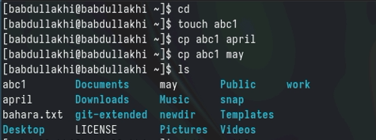{#fig:001 width=100%}

- 2) Копирование нескольких файлов в каталог. Скопировать файлы april и may в каталог monthly:

{#fig:001 width=100%}

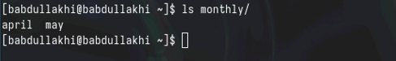{#fig:001 width=100%}

- 3) Копирование файлов в произвольном каталоге. Скопировать файл monthly/may в файл с именем june:

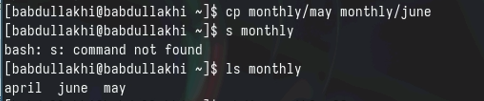{#fig:001 width=100%}

## Опция i в команде cp выведет на экран запрос подтверждения о перезаписи файла.Для рекурсивного копирования каталогов, содержащих файлы, используется команда cp с опцией r.

- Примеры:
- 1) Копирование каталогов в текущем каталоге. Скопировать каталог monthly в каталог monthly.00:

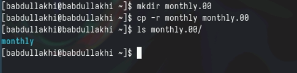{#fig:001 width=100%}

- 2) Копирование каталогов в произвольном каталоге. Скопировать каталог monthly.00 в каталог /tmp

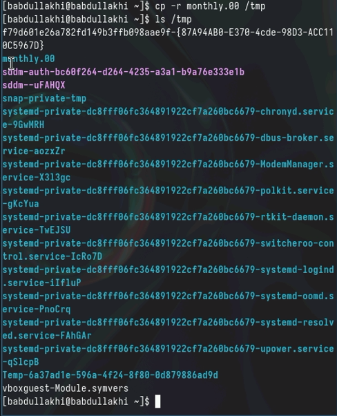{#fig:001 width=100%}

## Перемещение и переименование файлов и каталогов:
# Команды mv и mvdir предназначены для перемещения переименования файлов и каталогов. 

- Формат команды mv:

- Примеры:
- 1) Переименование файлов в текущем каталоге. Изменить название файла april на july в домашнем каталоге:

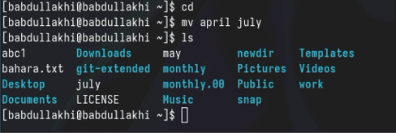{#fig:001 width=100%}

- 2) Перемещение файлов в другой каталог. Переместить файл july в каталог monthly.00:

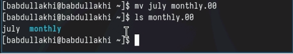{#fig:001 width=100%}

- 3) Переименование каталогов в текущем каталоге. Переименовать каталог monthly.00 в monthly.01

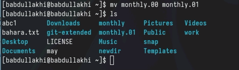{#fig:001 width=100%}

- 4) Перемещение каталога в другой каталог. Переместить каталог monthly.01в каталог reports:

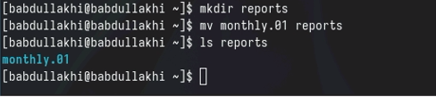{#fig:001 width=100%}

- 5) Переименование каталога, не являющегося текущим. Переименовать каталог reports/monthly.01 в reports/monthly:

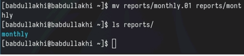{#fig:001 width=100%}

## Изменение прав доступа:

- Права доступа к файлу или каталогу можно изменить, воспользовавшись командой chmod. Сделать это может владелец файла (или каталога) или пользователь с правами
администратора.

- Примеры:
- 1) Требуется создать файл ~/may с правом выполнения для владельца:

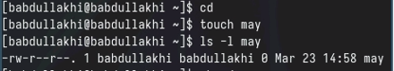{#fig:001 width=100%}

- 2) Требуется лишить владельца файла ~/may права на выполнение:

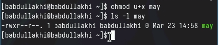{#fig:001 width=100%}

- 3) Требуется создать каталог monthly с запретом на чтение для членов группы и всех остальных пользователей:

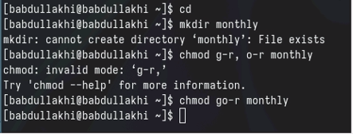{#fig:001 width=100%}

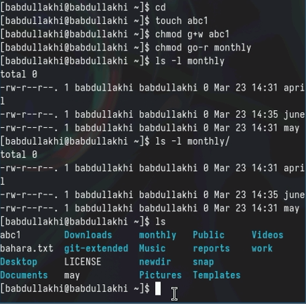{#fig:001 width=100%}

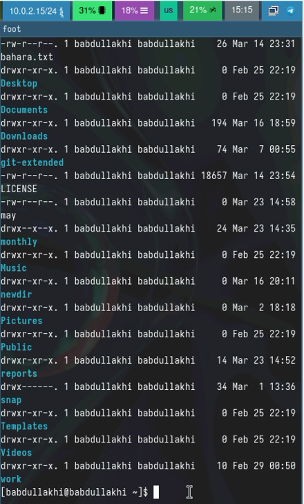{#fig:001 width=100%}

- 4) Требуется создать файл ~/abc1 с правом записи для членов группы:

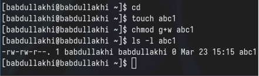{#fig:001 width=100%}

2. Выполните следующие действия, зафиксировав в отчёте по лабораторной работе используемые при этом команды и результаты их выполнения:

- Скопируйте файл /usr/include/sys/io.h в домашний каталог и назовите его equipment. Если файла io.h нет, то используйте любой другой файл в каталоге /usr/include/sys/ вместо него.

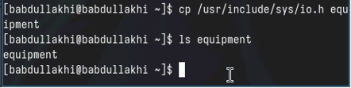{#fig:001 width=100%}

- В домашнем каталоге создайте директорию ~/ski.plases.
- Переместите файл equipment в каталог ~/ski.plases.

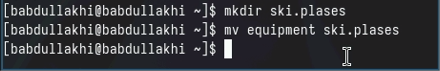{#fig:001 width=100%}

- Переименуйте файл ~/ski.plases/equipment в ~/ski.plases/equiplist.

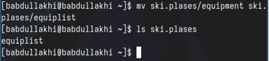{#fig:001 width=100%}

- Создайте в домашнем каталоге файл abc1 и скопируйте его в каталог ~/ski.plases, назовите его equiplist2.

{#fig:001 width=100%}

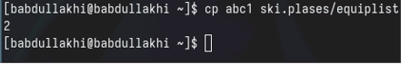{#fig:001 width=100%}

- Создайте каталог с именем equipment в каталоге ~ ski.plases.
- Переместите файлы ~/ski.plases/equiplist и equiplist2 в каталог ~/ski.plases/equipment.

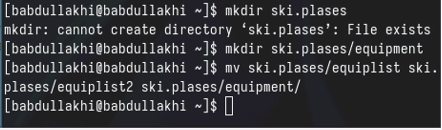{#fig:001 width=100%}

- Создайте и переместите каталог ~/newdir в каталог ~/ski.plases и назовите его plans.

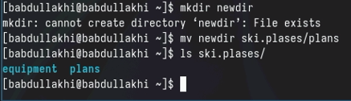{#fig:001 width=100%}

3. Определите опции команды chmod, необходимые для того, чтобы присвоить перечис- ленным ниже файлам выделенные права доступа, считая, что в начале таких правнет:
- 3.1)  drwxr--r-- ... australia 
- 3.2)  drwx--x--x ... play 
- 3.3)  -r-xr--r-- ... my_os 
- 3.4)  -rw-rw-r-- ... feathers
- При необходимости создайте нужные файлы.

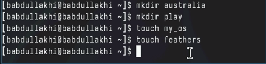{#fig:001 width=100%}

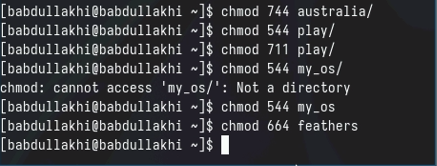{#fig:001 width=100%}

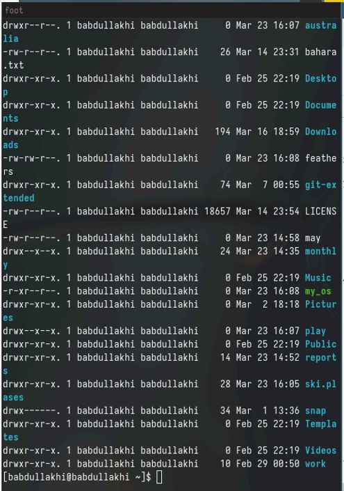{#fig:001 width=100%}

4. Проделайте приведённые ниже упражнения, записывая в отчёт по лабораторной работе используемые при этом команды:

- Просмотрите содержимое файла /etc/password.

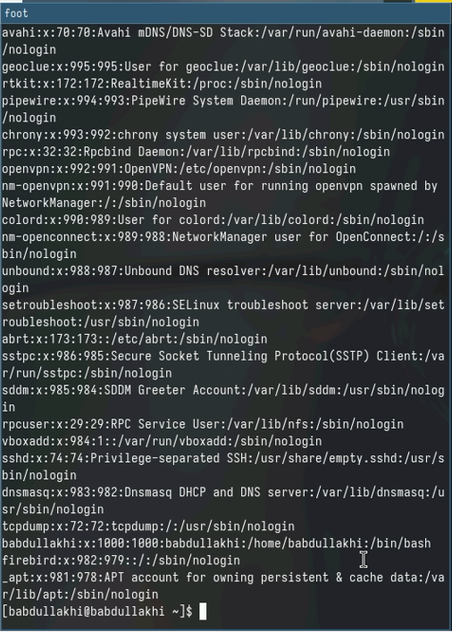{#fig:001 width=100%}

- Скопируйте файл ~/feathers в файл ~/file.old.
- Переместите файл ~/file.old в каталог ~/play.

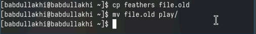{#fig:001 width=100%}

- Скопируйте каталог ~/play в каталог ~/fun.
- Переместите каталог ~/fun в каталог ~/play и назовите его games.

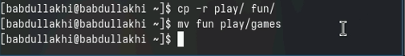{#fig:001 width=100%}

-  Лишите владельца файла ~/feathers права на чтение.
- Что произойдёт, если вы попытаетесь просмотреть файл ~/feathers командой cat?
- Что произойдёт, если вы попытаетесь скопировать файл ~/feathers?

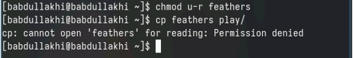{#fig:001 width=100%}

-  Дайте владельцу файла ~/feathers право на чтение.
-  Лишите владельца каталога ~/play права на выполнение.

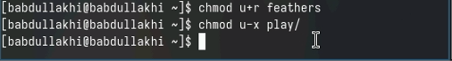{#fig:001 width=100%}

-  Перейдите в каталог ~/play. Что произошло?
-  Перейдите в каталог ~/play. Что произошло?

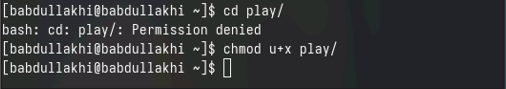{#fig:001 width=100%}

5. Прочитайте man по командам mount, fsck, mkfs, kill и кратко их охарактеризуйте, приведя примеры.

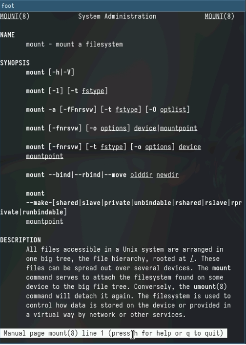{#fig:001 width=100%}

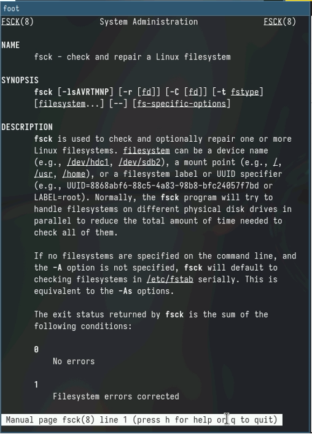{#fig:001 width=100%}

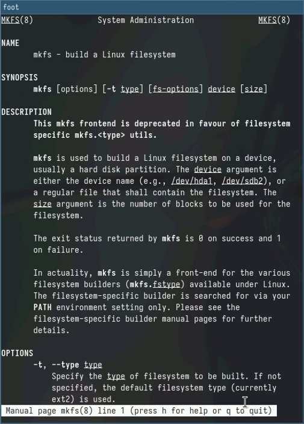{#fig:001 width=100%}

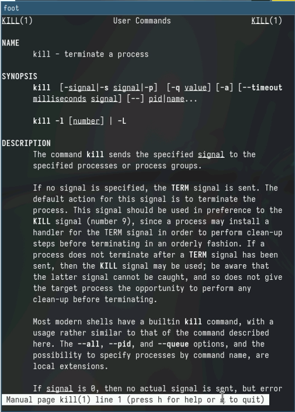{#fig:001 width=100%}

# Теоретическое введение

Здесь описываются теоретические аспекты, связанные с выполнением работы.

Например, в табл. [-@tbl:std-dir] приведено краткое описание стандартных каталогов Unix.

: Описание некоторых каталогов файловой системы GNU Linux {#tbl:std-dir}

| Имя каталога | Описание каталога                                                                                                          |
|--------------|----------------------------------------------------------------------------------------------------------------------------|
| `/`          | Корневая директория, содержащая всю файловую                                                                               |
| `/bin `      | Основные системные утилиты, необходимые как в однопользовательском режиме, так и при обычной работе всем пользователям     |
| `/etc`       | Общесистемные конфигурационные файлы и файлы конфигурации установленных программ                                           |
| `/home`      | Содержит домашние директории пользователей, которые, в свою очередь, содержат персональные настройки и данные пользователя |
| `/media`     | Точки монтирования для сменных носителей                                                                                   |
| `/root`      | Домашняя директория пользователя  `root`                                                                                   |
| `/tmp`       | Временные файлы                                                                                                            |
| `/usr`       | Вторичная иерархия для данных пользователя                                                                                 |

Более подробно про Unix см. в [@tanenbaum_book_modern-os_ru; @robbins_book_bash_en; @zarrelli_book_mastering-bash_en; @newham_book_learning-bash_en].

