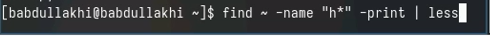

---
## Front matter
lang: ru-RU
title: " Лабораторной работе 8 "

author:
  - "Абдуллахи Бахара"
institute:
 
  - Объединённый институт ядерных исследований, Дубна, Россия
date: 30 Мар 2024

## i18n babel
babel-lang: russian
babel-otherlangs: english

## Fonts
mainfont: PT Serif
romanfont: PT Serif
sansfont: PT Sans
monofont: PT Mono
mainfontoptions: Ligatures=TeX
romanfontoptions: Ligatures=TeX
sansfontoptions: Ligatures=TeX,Scale=MatchLowercase
monofontoptions: Scale=MatchLowercase,Scale=0.9

## Formatting pdf
toc: false
toc-title: Содержание
slide_level: 2
aspectratio: 169
section-titles: true
theme: metropolis
header-includes:
 - \metroset{progressbar=frametitle,sectionpage=progressbar,numbering=fraction}
 - '\makeatletter'
 - '\beamer@ignorenonframefalse'
 - '\makeatother'
---

# Информация

## Докладчик

:::::::::::::: {.columns align=center}
::: {.column width="70%"}

  * Кулябов Дмитрий Сергеевич
  * д.ф.-м.н., профессор
  * профессор кафедры прикладной информатики и теории вероятностей
  * Российский университет дружбы народов
  * [kulyabov-ds@rudn.ru](mailto:kulyabov-ds@rudn.ru)
  * <https://yamadharma.github.io/ru/>

:::
::: {.column width="30%"}

:::
::::::::::::::

## Цель работы:

Ознакомление с инструментами поиска файлов и фильтрации текстовых данных.
Приобретение практических навыков: по управлению процессами (и заданиями), по
проверке использования диска и обслуживанию файловых систем.

## Выполнение лабораторной работы :

- 1. Осуществите вход в систему, используя соответствующее имя пользователя.

# 2. Запишите в файл file.txt названия файлов, содержащихся в каталоге /etc. Допи-
шите в этот же файл названия файлов, содержащихся в вашем домашнем каталоге.

# 3. Выведите имена всех файлов из file.txt, имеющих расширение .conf, после чего запишите их в новый текстовой файл conf.txt.

# 4. Определите, какие файлы в вашем домашнем каталоге имеют имена, начинавшиеся с символа c? Предложите несколько вариантов, как это сделать.

# 5. Выведите на экран (по странично) имена файлов из каталога /etc, начинающиеся с символа h.

# 6. Запустите в фоновом режиме процесс, который будет записывать в файл ~/logfile файлы, имена которых начинаются с log.

# 7. Удалите файл ~/logfile.

# 8. Запустите из консоли в фоновом режиме редактор gedit.

# 9. Определите идентификатор процесса gedit, используя команду ps, конвейер и фильтр grep. Как ещё можно определить идентификатор процесса?

# 10. Прочтите справку (man) команды kill, после чего используйте её для завершения процесса gedit.

# 11. Выполните команды df и du, предварительно получив более подробную информацию об этих командах, с помощью команды man.

#  12. Воспользовавшись справкой команды find, выведите имена всех директорий, имеющихся в вашем домашнем каталоге.

# Спасибо за винимание!

