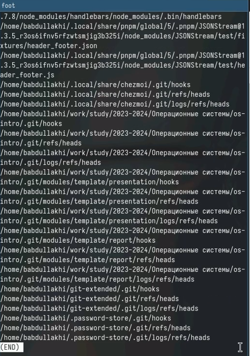

---
## Front matter
title: "Шаблон отчёта по лабораторной работе 8 "

author: "Абдуллахи Бахара"

## Generic otions
lang: ru-RU
toc-title: "Содержание"

## Bibliography
bibliography: bib/cite.bib
csl: pandoc/csl/gost-r-7-0-5-2008-numeric.csl

## Pdf output format
toc: true # Table of contents
toc-depth: 2
lof: true # List of figures
lot: true # List of tables
fontsize: 12pt
linestretch: 1.5
papersize: a4
documentclass: scrreprt
## I18n polyglossia
polyglossia-lang:
  name: russian
  options:
	- spelling=modern
	- babelshorthands=true
polyglossia-otherlangs:
  name: english
## I18n babel
babel-lang: russian
babel-otherlangs: english
## Fonts
mainfont: PT Serif
romanfont: PT Serif
sansfont: PT Sans
monofont: PT Mono
mainfontoptions: Ligatures=TeX
romanfontoptions: Ligatures=TeX
sansfontoptions: Ligatures=TeX,Scale=MatchLowercase
monofontoptions: Scale=MatchLowercase,Scale=0.9
## Biblatex
biblatex: true
biblio-style: "gost-numeric"
biblatexoptions:
  - parentracker=true
  - backend=biber
  - hyperref=auto
  - language=auto
  - autolang=other*
  - citestyle=gost-numeric
## Pandoc-crossref LaTeX customization
figureTitle: "Рис."
tableTitle: "Таблица"
listingTitle: "Листинг"
lofTitle: "Список иллюстраций"
lotTitle: "Список таблиц"
lolTitle: "Листинги"
## Misc options
indent: true
header-includes:
  - \usepackage{indentfirst}
  - \usepackage{float} # keep figures where there are in the text
  - \floatplacement{figure}{H} # keep figures where there are in the text
---

# Цель работы

Ознакомление с инструментами поиска файлов и фильтрации текстовых данных.
Приобретение практических навыков: по управлению процессами (и заданиями), по
проверке использования диска и обслуживанию файловых систем.

# Выполнение лабораторной работы :

- 1. Осуществите вход в систему, используя соответствующее имя пользователя.
- 2. Запишите в файл file.txt названия файлов, содержащихся в каталоге /etc. Допи-
шите в этот же файл названия файлов, содержащихся в вашем домашнем каталоге.

{#fig:001 width=100%}

{#fig:001 width=100%}

- 3. Выведите имена всех файлов из file.txt, имеющих расширение .conf, после чего запишите их в новый текстовой файл conf.txt.

{#fig:001 width=100%}

{#fig:001 width=100%}

{#fig:001 width=100%}

- 4. Определите, какие файлы в вашем домашнем каталоге имеют имена, начинавшиеся с символа c? Предложите несколько вариантов, как это сделать.

{#fig:001 width=100%}

{#fig:001 width=100%}

{#fig:001 width=100%}

- 5. Выведите на экран (по странично) имена файлов из каталога /etc, начинающиеся с символа h.

{#fig:001 width=100%}

{#fig:001 width=100%}

- 6. Запустите в фоновом режиме процесс, который будет записывать в файл ~/logfile файлы, имена которых начинаются с log.
{#fig:001 width=100%}

{#fig:001 width=100%}

- 7. Удалите файл ~/logfile.

{#fig:001 width=100%}

- 8. Запустите из консоли в фоновом режиме редактор gedit.

{#fig:001 width=100%}

- 9. Определите идентификатор процесса gedit, используя команду ps, конвейер и фильтр grep. Как ещё можно определить идентификатор процесса?

{#fig:001 width=100%}

- 10. Прочтите справку (man) команды kill, после чего используйте её для завершения процесса gedit.

{#fig:001 width=100%}

- 11. Выполните команды df и du, предварительно получив более подробную информацию об этих командах, с помощью команды man.

{#fig:001 width=100%}

{#fig:001 width=100%}

{#fig:001 width=100%}

{#fig:001 width=100%}

- 12. Воспользовавшись справкой команды find, выведите имена всех директорий, имеющихся в вашем домашнем каталоге.

{#fig:001 width=100%}

{#fig:001 width=100%}

## Контрольные вопросы:

1. Какие потоки ввода вывода вы знаете?

-  Основные потоки ввода-вывода в Unix-подобных системах - это stdin (стандартный ввод), stdout (стандартный вывод) и stderr (стандартный поток ошибок).

2. Объясните разницу между операцией > и >>.

-  Оператор > перенаправляет вывод команды в файл, заменяя его содержимое. Оператор >> дописывает вывод команды в конец файла.

3. Что такое конвейер?

- Конвейер (pipe) - это механизм, позволяющий передавать вывод одной команды на вход другой команды.

4. Что такое процесс? Чем это понятие отличается от программы?

- Процесс - это запущенная программа. Программа - это набор инструкций, а процесс - это выполнение этих инструкций в операционной системе.

5. Что такое PID и GID?

- PID (Process ID) - уникальный идентификатор процесса. GID (Group ID) - идентификатор группы, к которой принадлежит процесс.

6. Что такое задачи и какая команда позволяет ими управлять?

- Задачи (jobs) - это процессы, запущенные в фоновом режиме. Командой для управления ими является "jobs".

7. Найдите информацию об утилитах top и htop. Каковы их функции?

- top и htop - утилиты для мониторинга системных процессов и ресурсов. Они показывают загрузку CPU, памяти, список запущенных процессов и другую полезную информацию.

8. Назовите и дайте характеристику команде поиска файлов. Приведите примеры использования этой команды.

- Команда поиска файлов - find. Она позволяет искать файлы по различным критериям, таким как имя, размер, дата изменения и т.д. Например: "find / -name "*.txt" -type f".

9. Можно ли по контексту (содержанию) найти файл? Если да, то как?

- Да, можно найти файл по его содержимому, используя команду grep. Например: "grep -rl "искомый текст" /путь/к/каталогу".

10. Как определить объем свободной памяти на жёстком диске?

- 
Для определения объема свободной памяти на диске можно использовать команду "df -h".

11. Как определить объем вашего домашнего каталога?

- Для определения объема домашнего каталога можно использовать команду "du -sh ~".

12. Как удалить зависший процесс?

- Для удаления зависшего процесса можно использовать команду "kill PID", где PID - идентификатор процесса.

# Теоретическое введение

Здесь описываются теоретические аспекты, связанные с выполнением работы.

Например, в табл. [-@tbl:std-dir] приведено краткое описание стандартных каталогов Unix.

: Описание некоторых каталогов файловой системы GNU Linux {#tbl:std-dir}

| Имя каталога | Описание каталога                                                                                                          |
|--------------|----------------------------------------------------------------------------------------------------------------------------|
| `/`          | Корневая директория, содержащая всю файловую                                                                               |
| `/bin `      | Основные системные утилиты, необходимые как в однопользовательском режиме, так и при обычной работе всем пользователям     |
| `/etc`       | Общесистемные конфигурационные файлы и файлы конфигурации установленных
программ                                           |
| `/home`      | Содержит домашние директории пользователей, которые, в свою очередь, содержат персональные настройки и данные пользователя |
| `/media`     | Точки монтирования для сменных носителей                                                                                   |
| `/root`      | Домашняя директория пользователя  `root`                                                                                   |
| `/tmp`       | Временные файлы                                                                                                            |
| `/usr`       | Вторичная иерархия для данных пользователя                                                                                 |

Более подробно про Unix см. в [@tanenbaum_book_modern-os_ru; @robbins_book_bash_en; @zarrelli_book_mastering-bash_en; @newham_book_learning-bash_en].

