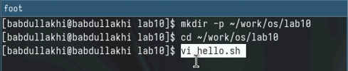
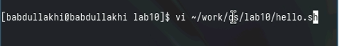
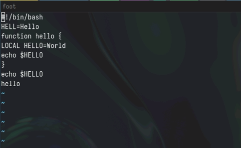
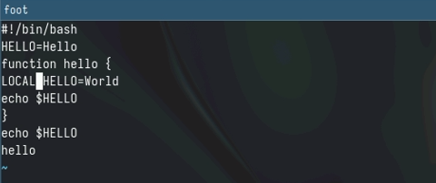
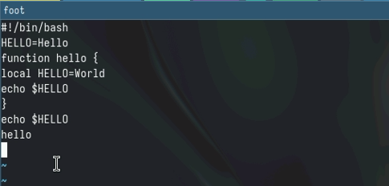
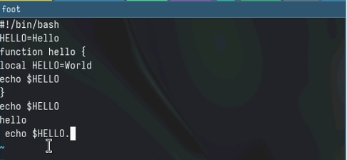
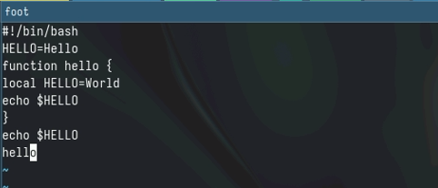
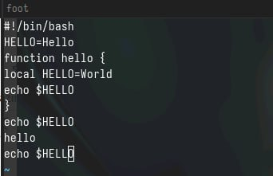
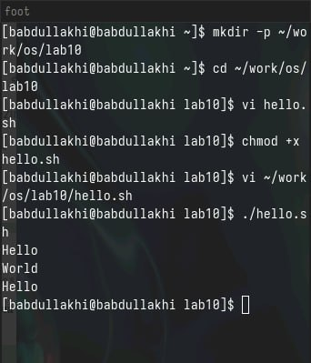

---
## Front matter
lang: ru-RU
title: " Лабораторной работе 10 "
subtitle: "Текстовой редактор vi"
author:
  - "Абдуллахи Бахара"
institute:

  - Объединённый институт ядерных исследований, Дубна, Россия
date: 13 Апрель 2024

## i18n babel
babel-lang: russian
babel-otherlangs: english

## Fonts
mainfont: PT Serif
romanfont: PT Serif
sansfont: PT Sans
monofont: PT Mono
mainfontoptions: Ligatures=TeX
romanfontoptions: Ligatures=TeX
sansfontoptions: Ligatures=TeX,Scale=MatchLowercase
monofontoptions: Scale=MatchLowercase,Scale=0.9

## Formatting pdf
toc: false
toc-title: Содержание
slide_level: 2
aspectratio: 169
section-titles: true
theme: metropolis
header-includes:
 - \metroset{progressbar=frametitle,sectionpage=progressbar,numbering=fraction}
 - '\makeatletter'
 - '\beamer@ignorenonframefalse'
 - '\makeatother'
---

# Информация

## Докладчик

:::::::::::::: {.columns align=center}
::: {.column width="70%"}

  * Кулябов Дмитрий Сергеевич
  * д.ф.-м.н., профессор
  * профессор кафедры прикладной информатики и теории вероятностей
  * Российский университет дружбы народов
  * [kulyabov-ds@rudn.ru](mailto:kulyabov-ds@rudn.ru)
  * <https://yamadharma.github.io/ru/>

:::
::: {.column width="30%"}

:::
::::::::::::::

## Цель работы:

Познакомиться с операционной системой Linux. Получить практические навыки работы с редактором vi, установленным по умолчанию практически во всех дистрибутивах.

## Выполнение лабораторной работы :

- 1. Ознакомиться с теоретическим материалом.
- 2. Ознакомиться с редактором vi.
- 3. Выполнить упражнения, используя команды vi.

# Задание 1. Создание нового файла с использованием vi:

- Создала в каталог work подкатагог с именой ~/work/os/lab10, и потом прешла в наш подкаталог и после этого я прешла в
этом каталог и Вызовила vi и создала файл hello.sh

- после этого открыли новые окно.Нажимала клавишу i и написала текст,Нажимала клавишу Esc для перехода в командный режим после завершения ввода,и потом нажимала : для перехода в режим последней строки и внизу вашего экрана появится
приглашение в виде двоеточия.Нажимала w (записать) и q (выйти), а затем нажмите клавишу Enter для сохранения
вашего текста и завершения работы.

# Сделайте файл исполняемым :

## Задание 2. Редактирование существующего файла: 

- 1. Вызовите vi на редактирование файла: vi ~/work/os/lab10/hello.sh

- 2.Установите курсор в конец слова HELL второй строки.
- 3.Перейдите в режим вставки и замените на HELLO. Нажмите Esc для возврата в командный режим.

- 4. Установите курсор на четвертую строку и сотрите слово LOCAL.
- 5.Перейдите в режим вставки и наберите следующий текст: local, нажмите Esc для возврата в командный режим.

- 6.Установите курсор на последней строке файла. Вставьте после неё строку, содержащую следующий текст: echo $HELLO.

- 7.Нажмите Esc для перехода в командный режим.

- 8. Удалите последнюю строку.
- 9. ведите команду отмены изменений u для отмены последней команды.

- 10. Введите символ : для перехода в режим последней строки. Запишите произведённые изменения и выйдите из vi.
- Запостить файла.

# Спасибо за винимание!

 

::

