---
## Front matter
title: "Шаблон отчёта по лабораторной работе 10 "
subtitle: "Текстовой редактор vi"
author: "Абдуллахи Бахара"

## Generic otions
lang: ru-RU
toc-title: "Содержание"

## Bibliography
bibliography: bib/cite.bib
csl: pandoc/csl/gost-r-7-0-5-2008-numeric.csl

## Pdf output format
toc: true # Table of contents
toc-depth: 2
lof: true # List of figures
lot: true # List of tables
fontsize: 12pt
linestretch: 1.5
papersize: a4
documentclass: scrreprt
## I18n polyglossia
polyglossia-lang:
  name: russian
  options:
	- spelling=modern
	- babelshorthands=true
polyglossia-otherlangs:
  name: english
## I18n babel
babel-lang: russian
babel-otherlangs: english
## Fonts
mainfont: PT Serif
romanfont: PT Serif
sansfont: PT Sans
monofont: PT Mono
mainfontoptions: Ligatures=TeX
romanfontoptions: Ligatures=TeX
sansfontoptions: Ligatures=TeX,Scale=MatchLowercase
monofontoptions: Scale=MatchLowercase,Scale=0.9
## Biblatex
biblatex: true
biblio-style: "gost-numeric"
biblatexoptions:
  - parentracker=true
  - backend=biber
  - hyperref=auto
  - language=auto
  - autolang=other*
  - citestyle=gost-numeric
## Pandoc-crossref LaTeX customization
figureTitle: "Рис."
tableTitle: "Таблица"
listingTitle: "Листинг"
lofTitle: "Список иллюстраций"
lotTitle: "Список таблиц"
lolTitle: "Листинги"
## Misc options
indent: true
header-includes:
  - \usepackage{indentfirst}
  - \usepackage{float} # keep figures where there are in the text
  - \floatplacement{figure}{H} # keep figures where there are in the text
---

# Цель работы

Познакомиться с операционной системой Linux. Получить практические навыки работы с редактором vi, установленным по умолчанию практически во всех дистрибутивах.

# Выполнение лабораторной работы:

- 1. Ознакомиться с теоретическим материалом.
- 2. Ознакомиться с редактором vi.
- 3. Выполнить упражнения, используя команды vi.

# Задание 1. Создание нового файла с использованием vi:

- Создала в каталог work подкатагог с именой ~/work/os/lab10, и потом прешла в наш подкаталог и после этого я прешла в
этом каталог и Вызовила vi и создала файл hello.sh

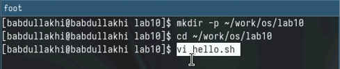{#fig:001 width=100%}

- после этого открыли новые окно.Нажимала клавишу i и написала текст,Нажимала клавишу Esc для перехода в командный режим после завершения ввода,и потом нажимала : для перехода в режим последней строки и внизу вашего экрана появится
приглашение в виде двоеточия.Нажимала w (записать) и q (выйти), а затем нажмите клавишу Enter для сохранения
вашего текста и завершения работы.

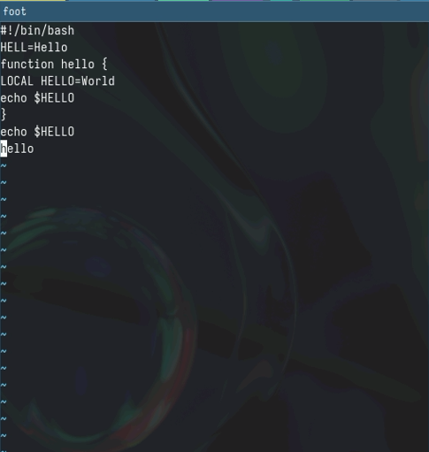{#fig:001 width=100%}

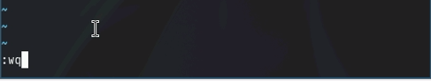{#fig:001 width=100%}

- Сделайте файл исполняемым 

{#fig:001 width=100%}

# Задание 2. Редактирование существующего файла: 

- 1. Вызовите vi на редактирование файла: vi ~/work/os/lab10/hello.sh

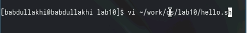{#fig:001 width=100%}

- 2.Установите курсор в конец слова HELL второй строки.
- 3.Перейдите в режим вставки и замените на HELLO. Нажмите Esc для возврата в командный режим.

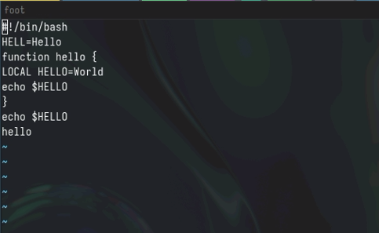{#fig:001 width=100%}

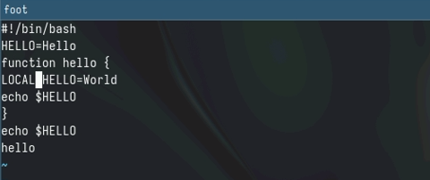{#fig:001 width=100%}

- 4. Установите курсор на четвертую строку и сотрите слово LOCAL.
- 5.Перейдите в режим вставки и наберите следующий текст: local, нажмите Esc для возврата в командный режим.

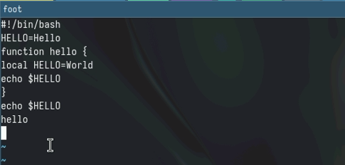{#fig:001 width=100%}

- 6.Установите курсор на последней строке файла. Вставьте после неё строку, содержащую следующий текст: echo $HELLO.

- 7.Нажмите Esc для перехода в командный режим.

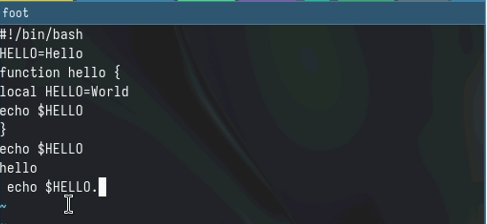{#fig:001 width=100%}

- 8. Удалите последнюю строку.
- 9. ведите команду отмены изменений u для отмены последней команды.

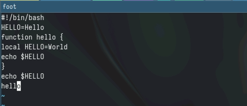{#fig:001 width=100%}

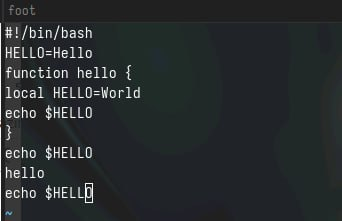{#fig:001 width=100%}

- 10. Введите символ : для перехода в режим последней строки. Запишите произведённые изменения и выйдите из vi.
- Запостить файла.

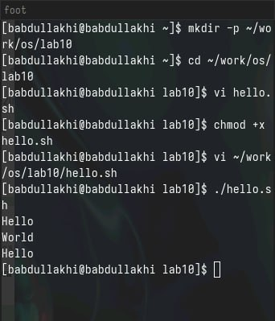{#fig:001 width=100%}

# Контрольные вопросы:
1. Дайте краткую характеристику режимам работы редактора vi.

- Режимы работы редактора vi: командный режим (Command mode), вставки
(Insert mode), режим последней строки (Last line mode).

2. Как выйти из редактора, не сохраняя произведённые изменения?

- Для выхода из редактора vi без сохранения изменений используйте коман ду “:q!”.

3. Назовите и дайте краткую характеристику командам позиционирования.

- Команды позиционирования включают перемещение курсора (h, j, k, l), пе реход к началу и концу строки (^, $), переход к началу и концу файла (gg,
G).

4. Что для редактора vi является словом?

- В редакторе vi слово - это последовательность символов, разделенных про белами или другими символами пробела.

5. Каким образом из любого места редактируемого файла перейти в начало (конец) файла?

- Для перехода в начало файла используйте команду “gg”, для перехода в
конец файла - “G”.

6. Назовите и дайте краткую характеристику основным группам команд редактирования.

- Основные группы команд редактирования включают команды удаления,
вставки, замены, поиска и замены.

7. Необходимо заполнить строку символами $. Каковы ваши действия?

-  Для заполнения строки символами $ можно использовать команду “A” в
командном режиме, чтобы добавить символы в конец строки.

8. Как отменить некорректное действие, связанное с процессом редактирования?

- Некорректное действие в процессе редактирования можно отменить с по мощью команды “u” (отмена) в командном режиме.

9. Назовите и дайте характеристику основным группам команд режима последней строки.

- Основные группы команд режима последней строки включают команды
сохранения, выхода, поиска и замены.

10. Как определить, не перемещая курсора, позицию, в которой заканчивается строка?

- Позицию, в которой заканчивается строка, можно определить, не переме щая курсор, используя команду “$” в командном режиме.

11. Выполните анализ опций редактора vi (сколько их, как узнать их назначение и т.д.).

- Опции редактора vi можно узнать, выполнив команду “:set” в команд ном режиме. Они могут быть настроены с помощью команды “:set
option=value”.

12. Как определить режим работы редактора vi?

- Режим работы редактора vi отображается в левом нижнем углу экрана. На пример, “INSERT” для режима вставки.

13. Постройте граф взаимосвязи режимов работы редактора vi.

- Граф взаимосвязи режимов работы редактора vi можно представить следу ющим образом
1. Командный режим (Command mode) -> Режим вставки (Insert mode)
2. Командный режим (Command mode) -> Режим последней строки (Last line mode)

# Теоретическое введение

Здесь описываются теоретические аспекты, связанные с выполнением работы.

Например, в табл. [-@tbl:std-dir] приведено краткое описание стандартных каталогов Unix.

: Описание некоторых каталогов файловой системы GNU Linux {#tbl:std-dir}

| Имя каталога | Описание каталога                                                                                                          |
|--------------|----------------------------------------------------------------------------------------------------------------------------|
| `/`          | Корневая директория, содержащая всю файловую                                                                               |
| `/bin `      | Основные системные утилиты, необходимые как в однопользовательском режиме, так и при обычной работе всем пользователям     |
| `/etc`       | Общесистемные конфигурационные файлы и файлы конфигурации установленных программ 
| `/home`      | Содержит домашние директории пользователей, которые, в свою очередь, содержат персональные настройки и данные пользователя |
| `/media`     | Точки монтирования для сменных носителей                                                                                   |
| `/root`      | Домашняя директория пользователя  `root`                                                                                   |
| `/tmp`       | Временные файлы                                                                                                            |
| `/usr`       | Вторичная иерархия для данных пользователя                                                                                 |

Более подробно про Unix см. в [@tanenbaum_book_modern-os_ru; @robbins_book_bash_en; @zarrelli_book_mastering-bash_en; @newham_book_learning-bash_en].

# Список литературы{.unnumbered}

::: {#refs}
:::
