---
## Front matter
lang: ru-RU
title: Лабораторной работе 11
subtitle: "Текстовой редактор emacs"
author:
  - "Абдуллахи Бахара"
institute:
  
  - Объединённый институт ядерных исследований, Дубна, Россия
date: 20 Апрель 2024

## i18n babel
babel-lang: russian
babel-otherlangs: english

## Fonts
mainfont: PT Serif
romanfont: PT Serif
sansfont: PT Sans
monofont: PT Mono
mainfontoptions: Ligatures=TeX
romanfontoptions: Ligatures=TeX
sansfontoptions: Ligatures=TeX,Scale=MatchLowercase
monofontoptions: Scale=MatchLowercase,Scale=0.9

## Formatting pdf
toc: false
toc-title: Содержание
slide_level: 2
aspectratio: 169
section-titles: true
theme: metropolis
header-includes:
 - \metroset{progressbar=frametitle,sectionpage=progressbar,numbering=fraction}
 - '\makeatletter'
 - '\beamer@ignorenonframefalse'
 - '\makeatother'
---

## Докладчик

:::::::::::::: {.columns align=center}
::: {.column width="70%"}

  * Кулябов Дмитрий Сергеевич
  * д.ф.-м.н., профессор
  * профессор кафедры прикладной информатики и теории вероятностей
  * Российский университет дружбы народов
  * [kulyabov-ds@rudn.ru](mailto:kulyabov-ds@rudn.ru)
  * <https://yamadharma.github.io/ru/>

:::
::: {.column width="30%"}

:::
::::::::::::::

## Цель работы:

Познакомиться с операционной системой Linux. Получить практические навыки работы с редактором Emacs.

## Выполнение лабораторной работы :

- 1. Ознакомиться с теоретическим материалом.
- 2. Ознакомиться с редактором emacs.
- 3. Выполнить упражнения.
- 4. Ответить на контрольные вопросы.

## Основные команды emacs:

#  Открыть emacs.
- сначала установила emacs,потом открываем emacs:emacs &

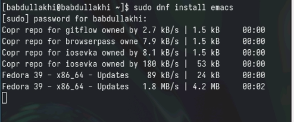

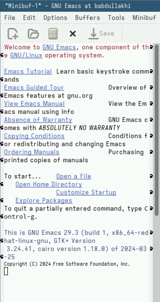

- 2. Создать файл lab07.sh с помощью комбинации Ctrl-x Ctrl-f (C-x C-f)

- 3. Наберите текст:

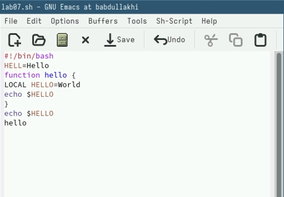

- 4. Сохранить файл с помощью комбинации Ctrl-x Ctrl-s (C-x C-s).

## 5. Проделать с текстом стандартные процедуры редактирования, каждое действие должно осуществляться комбинацией клавиш.

# 5.1. Вырезать одной командой целую строку (С-k).

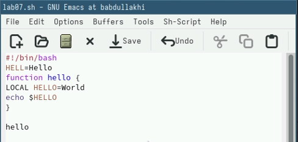

# 5.2. Вставить эту строку в конец файла (C-y).

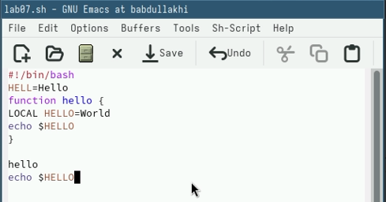

# 5.3. Выделить область текста (C-space).

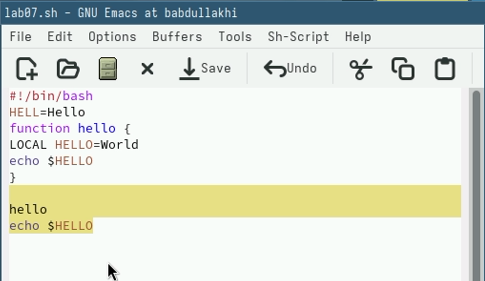

#  5.4. Скопировать область в буфер обмена (M-w).
#  5.5. Вставить область в конец файла.ctrl+y

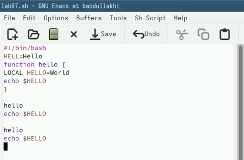

# 5.6. Вновь выделить эту область и на этот раз вырезать её (C-w).

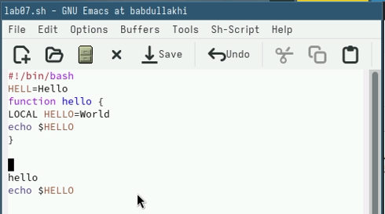

# 5.7. Отмените последнее действие (C-/)

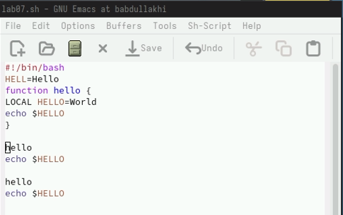

## 6. Научитесь использовать команды по перемещению курсора.

#  6.1. Переместите курсор в начало строки (C-a).

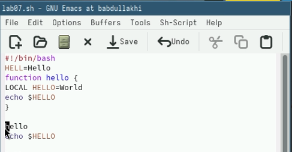

#  6.2. Переместите курсор в конец строки (C-e).

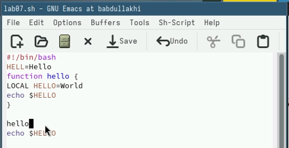

- 6.3. Переместите курсор в начало буфера (M-<).

- 6.4. Переместите курсор в конец буфера (M->).

## 7. Управление буферами.

#  7.1. Вывести список активных буферов на экран (C-x C-b).

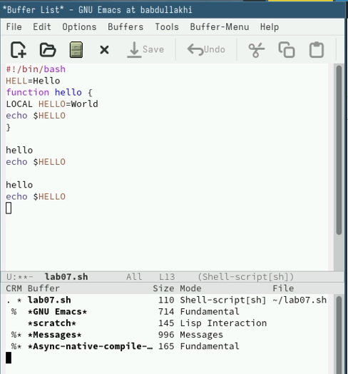

#  7.2. Переместитесь во вновь открытое окно (C-x) o сосписком открытых буферов и переключитесь на другой буфер.

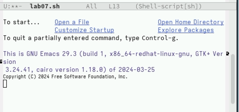

- 7.3. Закройте это окно (C-x 0).
- 7.4. Теперь вновь переключайтесь между буферами, но уже без вывода их списка на экран (C-x b).

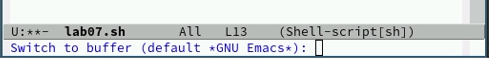

## 8. Управление окнами.

#  8.1. Поделите фрейм на 4 части: разделите фрейм на два окна по вертикали (C-x 3), а затем каждое из этих окон на две части по горизонтали (C-x 2) 

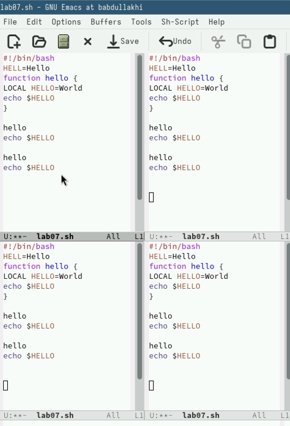

#  8.2. В каждом из четырёх созданных окон откройте новый буфер (файл) и введите несколько строк текста.

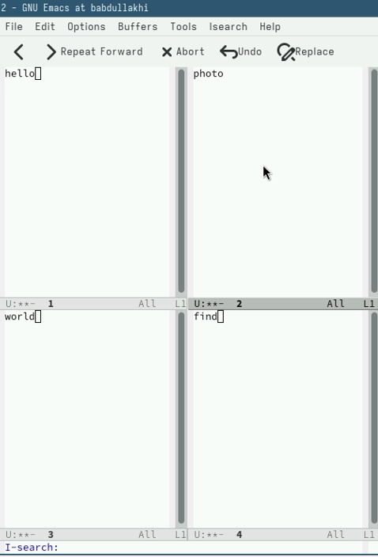

## 9. Режим поиска

#  9.1. Переключитесь в режим поиска (C-s) и найдите несколько слов, присутствующих в тексте.

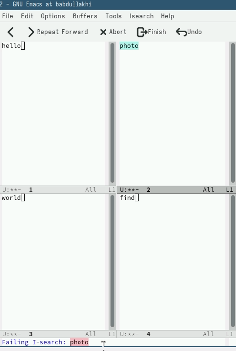

#  9.2. Переключайтесь между результатами поиска, нажимая C-s.

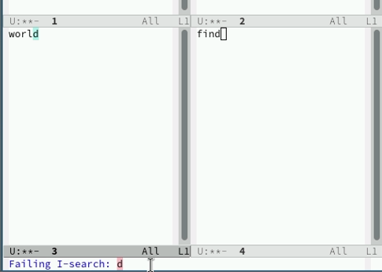

#  9.3. после этого мы Выйдим из режима поиска, нажав C-g

#  9.4. Перейдите в режим поиска и замены (M-%), введите текст, который следует найти и заменить, нажмите "Enter" ,затем введите текст для замены. После того как будут подсвечены результаты поиска, нажмите ! для подтверждения замены.

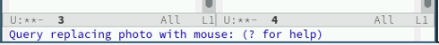

#  9.5. Испробуйте другой режим поиска, нажав M-s o.Объясните, чем он отличается от обычного режима?

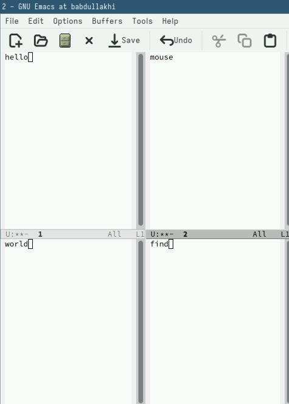

- Нашла слово на новое окно

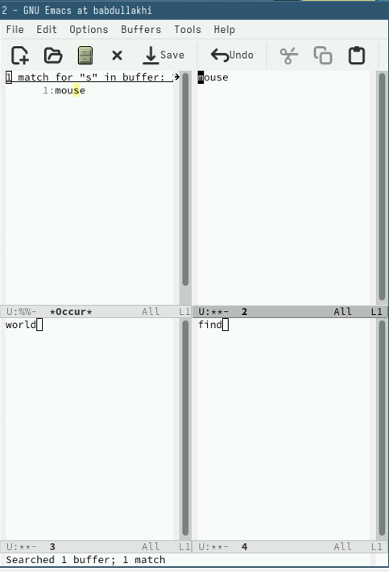

# Спасибо за винимание!

