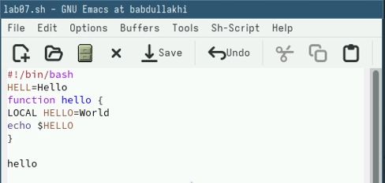

---
## Front matter
title: "Шаблон отчёта по лабораторной работе 11"
subtitle: "Текстовой редактор emacs"
author: "Абдуллахи Бахара"

## Generic otions
lang: ru-RU
toc-title: "Содержание"

## Bibliography
bibliography: bib/cite.bib
csl: pandoc/csl/gost-r-7-0-5-2008-numeric.csl

## Pdf output format
toc: true # Table of contents
toc-depth: 2
lof: true # List of figures
lot: true # List of tables
fontsize: 12pt
linestretch: 1.5
papersize: a4
documentclass: scrreprt
## I18n polyglossia
polyglossia-lang:
  name: russian
  options:
	- spelling=modern
	- babelshorthands=true
polyglossia-otherlangs:
  name: english
## I18n babel
babel-lang: russian
babel-otherlangs: english
## Fonts
mainfont: PT Serif
romanfont: PT Serif
sansfont: PT Sans
monofont: PT Mono
mainfontoptions: Ligatures=TeX
romanfontoptions: Ligatures=TeX
sansfontoptions: Ligatures=TeX,Scale=MatchLowercase
monofontoptions: Scale=MatchLowercase,Scale=0.9
## Biblatex
biblatex: true
biblio-style: "gost-numeric"
biblatexoptions:
  - parentracker=true
  - backend=biber
  - hyperref=auto
  - language=auto
  - autolang=other*
  - citestyle=gost-numeric
## Pandoc-crossref LaTeX customization
figureTitle: "Рис."
tableTitle: "Таблица"
listingTitle: "Листинг"
lofTitle: "Список иллюстраций"
lotTitle: "Список таблиц"
lolTitle: "Листинги"
## Misc options
indent: true
header-includes:
  - \usepackage{indentfirst}
  - \usepackage{float} # keep figures where there are in the text
  - \floatplacement{figure}{H} # keep figures where there are in the text
---

# Теоретическое введение

Здесь описываются теоретические аспекты, связанные с выполнением работы.

Например, в табл. [-@tbl:std-dir] приведено краткое описание стандартных каталогов Unix.

: Описание некоторых каталогов файловой системы GNU Linux {#tbl:std-dir}

| Имя каталога | Описание каталога                                                                                                          |
|--------------|----------------------------------------------------------------------------------------------------------------------------|
| `/`          | Корневая директория, содержащая всю файловую                                                                               |
| `/bin `      | Основные системные утилиты, необходимые как в однопользовательском режиме, так и при обычной работе всем пользователям     |
| `/etc`       | Общесистемные конфигурационные файлы и файлы конфигурации установленных программ                                           |
| `/home`      | Содержит домашние директории пользователей, которые, в свою очередь, содержат персональные настройки и данные пользователя |
| `/media`     | Точки монтирования для сменных носителей                                                                                   |
| `/root`      | Домашняя директория пользователя  `root`                                                                                   |
| `/tmp`       | Временные файлы                                                                                                            |
| `/usr`       | Вторичная иерархия для данных пользователя                                                                                 |

Более подробно про Unix см. в [@tanenbaum_book_modern-os_ru; @robbins_book_bash_en; @zarrelli_book_mastering-bash_en; @newham_book_learning-bash_en].

{#fig:001 width=70%}

# Цель работы:

- Познакомиться с операционной системой Linux. Получить практические навыки рабо-
ты с редактором Emacs.

# Выполнение лабораторной работы:

- 1. Ознакомиться с теоретическим материалом.
- 2. Ознакомиться с редактором emacs.
- 3. Выполнить упражнения.
- 4. Ответить на контрольные вопросы.

## Основные команды emacs:

1. Открыть emacs.
- сначала установила emacs,потом открываем emacs:emacs &

{#fig:001 width=100%}

{#fig:001 width=100%}

- 2. Создать файл lab07.sh с помощью комбинации Ctrl-x Ctrl-f (C-x C-f)

- 3. Наберите текст:

{#fig:001 width=100%}

- 4. Сохранить файл с помощью комбинации Ctrl-x Ctrl-s (C-x C-s).

#  5. Проделать с текстом стандартные процедуры редактирования, каждое действие должно осуществляться комбинацией клавиш.

- 5.1. Вырезать одной командой целую строку (С-k).

{#fig:001 width=100%}

- 5.2. Вставить эту строку в конец файла (C-y).

{#fig:001 width=100%}

- 5.3. Выделить область текста (C-space).

{#fig:001 width=100%}

- 5.4. Скопировать область в буфер обмена (M-w).
- 5.5. Вставить область в конец файла.ctrl+y

{#fig:001 width=100%}

5.6. Вновь выделить эту область и на этот раз вырезать её (C-w).

{#fig:001 width=100%}

5.7. Отмените последнее действие (C-/)

{#fig:001 width=100%}

# 6. Научитесь использовать команды по перемещению курсора.

- 6.1. Переместите курсор в начало строки (C-a).

{#fig:001 width=100%}

- 6.2. Переместите курсор в конец строки (C-e).

{#fig:001 width=100%}

- 6.3. Переместите курсор в начало буфера (M-<).

- 6.4. Переместите курсор в конец буфера (M->).

# 7. Управление буферами.

- 7.1. Вывести список активных буферов на экран (C-x C-b).

{#fig:001 width=100%}

- 7.2. Переместитесь во вновь открытое окно (C-x) o сосписком открытых буферов и переключитесь на другой буфер.

{#fig:001 width=100%}

- 7.3. Закройте это окно (C-x 0).
- 7.4. Теперь вновь переключайтесь между буферами, но уже без вывода их списка на экран (C-x b).

{#fig:001 width=100%}

# 8. Управление окнами.

- 8.1. Поделите фрейм на 4 части: разделите фрейм на два окна по вертикали (C-x 3), а затем каждое из этих окон на две части по горизонтали (C-x 2) 

{#fig:001 width=100%}

- 8.2. В каждом из четырёх созданных окон откройте новый буфер (файл) и введите несколько строк текста.

{#fig:001 width=100%}

# 9. Режим поиска

- 9.1. Переключитесь в режим поиска (C-s) и найдите несколько слов, присутствующих в тексте.

{#fig:001 width=100%}

- 9.2. Переключайтесь между результатами поиска, нажимая C-s.

{#fig:001 width=100%}

- 9.3. после этого мы Выйдим из режима поиска, нажав C-g

- 9.4. Перейдите в режим поиска и замены (M-%), введите текст, который следует найти и заменить, нажмите "Enter" ,затем введите текст для замены. После того как будут подсвечены результаты поиска, нажмите ! для подтверждения замены.

{#fig:001 width=100%}

{#fig:001 width=100%}

- 9.5. Испробуйте другой режим поиска, нажав M-s o.Объясните, чем он отличается от обычного режима?

{#fig:001 width=100%}

- Нашла слово на новое окно

{#fig:001 width=100%}

# Контрольные вопросы:

1. Кратко охарактеризуйте редактор emacs.
- Emacs это один из наиболее мощных и широко распространённых редакторов, используемых в мире Unix.По популярности он соперничает с редактором vi и его клонами. В зависимости от ситуации, Emacs может быть текстовым редактором; программой для чтения почты и новостей Usenet; интегрированной средой разработки (IDE); операционной системой и т.д. Всё это разнообразие достигается благодаря архитектуре Emacs, которая позволяет расширять возможности редактора при помощи языка Emacs Lisp. На языке C написаны лишь самые базовые и низкоуровневые части Emacs,включая полнофункциональный. интерпретатор языка Lisp. Таким образом, Emacs имеет встроенный язык программирования, который может использоваться для настройки, расширения и изменения поведения редактора. В действительности, большая часть того редактора, с которым пользователи Emacs работают в нашидни,написана на языке Lisp.

2. Какие особенности данного редактора могут сделать его сложным для освоения новичком? 
- Основную трудность для новичков при освоении данного редактора могут составлять большое количество команд, комбинаций клавиш, которые не получится все запомнить с первого раза и поэтоупридется часто обращаться к справочным материалам.

3. Своими словами опишите, что такое буфер и окно в терминологии emacs’а.
 - Своими словами опишите, что такое буфер и окно в терминологии emacs’а. Буфер–это объект, представляющий собой текст. Если имеется несколько буферов, то редактировать можно только один. Обычно буфер считыва 20 ет данные из файла или записывает в файл данные из буфера. Окно–это область экрана, отображающая буфер. При запуске редактора отображает ся одно окно, но при обращении к некоторым функциям могут открыть ся дополнительные окна. Окна Emacsи окна графической среды XWindow разные вещи. Одно окно XWindowможет быть разбито на несколько окон в смысле Emacs, в каждом из которых отображается отдельный буфер.

4. Можно ли открыть больше 10 буферов в одном окне? 
- Да, можно.

5. Какие буферы создаются по умолчанию при запуске emacs? 
- При запуске Emacs по умолчанию создаются следующие буферы: «scratch»(буфер
для несохраненного текста) «Messages»(журнал ошибок, включаю щий такжеинформацию, которая появляется в области EchoArea)
«GNUEmacs»(справочный буфер о редакторе).
6. Какие клавиши вы нажмёте, чтобы ввести следующую комбинацию C-c |?
- C-c C-|? C-c |сначала, удерживая «ctrl»,нажимаю «c»,после отпускаюобе клавишии нажимаю «|» C-cC-|сначала, удерживая «ctrl»,нажимаю «с», по сле –отпускаю обе клавиши и, удерживая «ctrl», нажимаю «|».
7. Как поделить текущее окно на две части? 
- Чтобы поделить окно на две части необходимо воспользоваться комбинацией «Ctrl-x 3»(по вертикали) или «Ctrl-x 2» (по горизонтали).
8. В каком файле хранятся настройки редактора emacs?
- Настройки Emacsхра нятся в файле .emacs.

9. Какую функцию выполняет клавиша и можно ли её переназначить? 
- По умолчанию клавиша «» удаляет символперед курсором, нов редакторе её можно переназначить. Для этого необхдимоизменить конфигурацию файла .emacs

10. Какой редактор вам показался удобнее в работе vi или emacs? Поясните почему.

- Поясните почему. Более удобным я считаю редактор emacs, потому чтов нем проще открывать другие файлы, можно использовать сразу несколько окон, нет «Командногорежима», «Режима ввода», «Режима командной строки», которые являются немного непривычными и в какой-то степени неудобным.

