---
## Front matter
title: "Шаблон отчёта по лабораторной работе 12"
subtitle: "Программирование в командном
процессоре ОС UNIX."
author: "Абдуллахи Бахара"

## Generic otions
lang: ru-RU
toc-title: "Содержание"

## Bibliography
bibliography: bib/cite.bib
csl: pandoc/csl/gost-r-7-0-5-2008-numeric.csl

## Pdf output format
toc: true # Table of contents
toc-depth: 2
lof: true # List of figures
lot: true # List of tables
fontsize: 12pt
linestretch: 1.5
papersize: a4
documentclass: scrreprt
## I18n polyglossia
polyglossia-lang:
  name: russian
  options:
	- spelling=modern
	- babelshorthands=true
polyglossia-otherlangs:
  name: english
## I18n babel
babel-lang: russian
babel-otherlangs: english
## Fonts
mainfont: PT Serif
romanfont: PT Serif
sansfont: PT Sans
monofont: PT Mono
mainfontoptions: Ligatures=TeX
romanfontoptions: Ligatures=TeX
sansfontoptions: Ligatures=TeX,Scale=MatchLowercase
monofontoptions: Scale=MatchLowercase,Scale=0.9
## Biblatex
biblatex: true
biblio-style: "gost-numeric"
biblatexoptions:
  - parentracker=true
  - backend=biber
  - hyperref=auto
  - language=auto
  - autolang=other*
  - citestyle=gost-numeric
## Pandoc-crossref LaTeX customization
figureTitle: "Рис."
tableTitle: "Таблица"
listingTitle: "Листинг"
lofTitle: "Список иллюстраций"
lotTitle: "Список таблиц"
lolTitle: "Листинги"
## Misc options
indent: true
header-includes:
  - \usepackage{indentfirst}
  - \usepackage{float} # keep figures where there are in the text
  - \floatplacement{figure}{H} # keep figures where there are in the text
---
# Теоретическое введение

Здесь описываются теоретические аспекты, связанные с выполнением работы.

Например, в табл. [-@tbl:std-dir] приведено краткое описание стандартных каталогов Unix.

: Описание некоторых каталогов файловой системы GNU Linux {#tbl:std-dir}

| Имя каталога | Описание каталога                                                                                                          |
|--------------|----------------------------------------------------------------------------------------------------------------------------|
| `/`          | Корневая директория, содержащая всю файловую                                                                               |
| `/bin `      | Основные системные утилиты, необходимые как в однопользовательском режиме, так и при обычной работе всем пользователям     |
| `/etc`       | Общесистемные конфигурационные файлы и файлы конфигурации установленных программ                                           |
| `/home`      | Содержит домашние директории пользователей, которые, в свою очередь, содержат персональные настройки и данные пользователя |
| `/media`     | Точки монтирования для сменных носителей                                                                                   |
| `/root`      | Домашняя директория пользователя  `root`                                                                                   |
| `/tmp`       | Временные файлы                                                                                                            |
| `/usr`       | Вторичная иерархия для данных пользователя                                                                                 |

Более подробно про Unix см. в [@tanenbaum_book_modern-os_ru; @robbins_book_bash_en; @zarrelli_book_mastering-bash_en; @newham_book_learning-bash_en].

{#fig:001 width=70%}

# Цель работы:

Изучить основы программирования в оболочке ОС UNIX/Linux. Научиться писать
небольшие командные файлы.

# Выполнение лабораторной работы:

1. Написать скрипт, который при запуске будет делать резервную копию самого себя (то есть файла, в котором содержится его исходный код) в другую директорию backup в вашем домашнем каталоге. При этом файл должен архивироваться одним из архиваторов на выбор zip, bzip2 или tar. Способ использования команд архивации необходимо узнать, изучив справку.

- в этом разделе сначала я создала каталог backup после этого я создала файл task1.sh, в этом я написала следушие код чтобы сделала архивироваться.

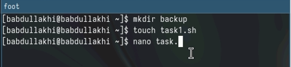{#fig:001 width=100%}

- Написание первого скрипта.

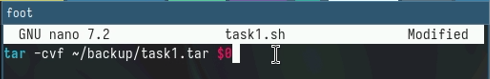{#fig:001 width=100%}

- Право на выполнение, запуск файла и проверка.

{#fig:001 width=100%}

2. Написать пример командного файла, обрабатывающего любое произвольное число аргументов командной строки, в том числе превышающее десять. Например, скрипт может последовательно распечатывать значения всех переданных аргументов.

- опять я создала файл для втрого скрепта task2.sh

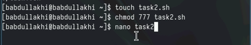{#fig:001 width=100%}

- Печатаем все аргументы командной строки
• обрабатывающего любое произвольное число аргументов командной строкию

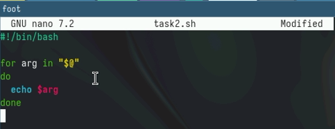{#fig:001 width=100%}

- Право на выполнение, запуск файла и проверка

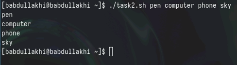{#fig:001 width=100%}

3. Написать командный файл — аналог команды ls (без использования самой этой команды и команды dir). Требуется, чтобы он выдавал информацию о нужном каталоге и выводил информацию о возможностях доступа к файлам этого каталога.

- опять я создала файл для 3 скрепта task3.sh

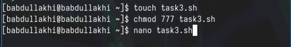{#fig:001 width=100%}

- Командный файл — аналог команды ls (без использования самой этой ко манды и команды dir)

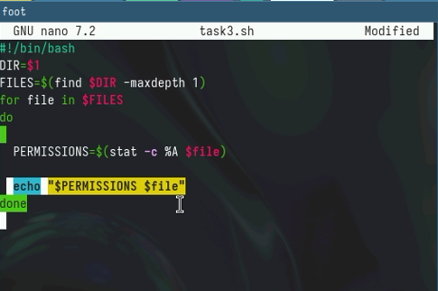{#fig:001 width=100%}

- Право на выполнение, запуск файла и проверка

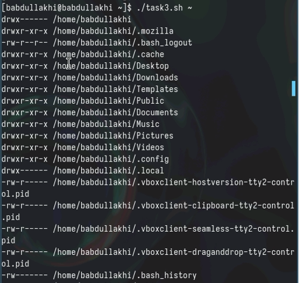{#fig:001 width=100%}

4. Написать командный файл, который получает в качестве аргумента командной строки формат файла (.txt, .doc, .jpg, .pdf и т.д.) и вычисляет количество таких файлов в указанной директории. Путь к директории также передаётся в виде аргумента командной строки.

- опять я создала файл для 3 скрепта 

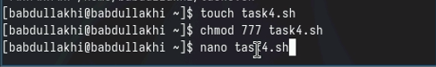{#fig:001 width=100%}

- Командный файл, который получает в качестве аргумента командной строки формат файла (.txt, .doc, .jpg, .pdf и т.д.) и вычисляет количество таких файлов в указанной директории.

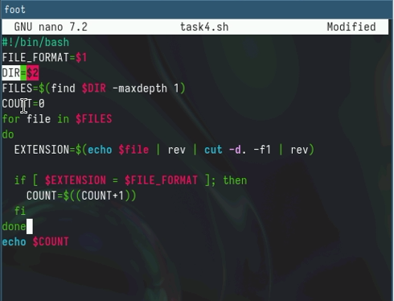{#fig:001 width=100%}

- Право на выполнение, запуск файла и проверка

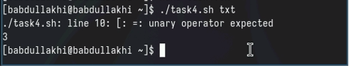{#fig:001 width=100%}

#  Ответы на контрольные вопросы:

1. Объясните понятие командной оболочки. Приведите примеры командных оболочек. Чем они отличаются?
Ответ: Командная оболочка - это программа, которая предоставляет пользо вателю интерфейс для взаимодействия с операционной системой. Она прини мает команды от пользователя и выполняет их. Примеры командных оболочек:
• Bash
• Zsh
• Tcsh
• Ksh
• Csh
Отличия между ними заключаются в наборе встроенных команд, синтаксисе
и возможностях настройки.
2. Что такое POSIX?
Ответ: POSIX (Portable Operating System Interface for Unix) - это набор стандар тов, которые определяют интерфейс между операционной системой и прило жениями. Он обеспечивает переносимость программного обеспечения между
различными Unix-подобными системами.
3. Как определяются переменные и массивы в языке программирования bash?
Ответ:
• Переменные: Объявляются с помощью оператора присваивания (=). Напри мер: VAR=value.
• Массивы: Объявляются с использованием круглых скобок и разделяются
пробелами. Например: ARRAY=(value1 value2 value3).
4. Каково назначение операторов let и read?
Ответ:
• let: Используется для выполнения арифметических операций и присваива ния значений переменным.
• read: Считывает ввод с устройства ввода и присваивает его переменной.
5. Какие арифметические операции можно применять в языке программи рования bash?
Ответ:
• Сложение (+)
• Вычитание (-)
• Умножение (*)
• Деление (/)
• Остаток от деления (%)
• Возведение в степень (**)
6. Что означает операция (( ))?
Ответ: Операция (( )) используется для выполнения более сложных арифмети ческих операций, включая логические и условные операции.
7. Какие стандартные имена переменных Вам известны?
Ответ:
• $? - код возврата последней выполненной команды
12
• $$ - идентификатор текущего процесса
• $! - идентификатор последней запущенной фоновой задачи
• $# - количество аргументов, переданных в командный файл
• $@ - массив всех аргументов, переданных в командный файл
8. Что такое метасимволы?
Ответ: Метасимволы - это специальные символы, которые имеют особое зна чение в командной оболочке. Например:
• * - совпадает с любым количеством любых символов
• ? - совпадает с любым одним символом
• [ ] - совпадает с любым символом внутри квадратных скобок
9. Как экранировать метасимволы?
Ответ: Метасимволы можно экранировать с помощью обратной косой черты
(). Например: * будет совпадать с символом звездочки (*).
10. Как создавать и запускать командные файлы?
Ответ:
• Создание: Используйте текстовый редактор, чтобы создать файл с расшире нием .sh и ввести команды bash.
• Запуск: Введите ./filename.sh в командной строке.
11. Как определяются функции в языке программирования bash?
Ответ: Функции определяются с использованием ключевого слова function, за которым следует имя функции и список параметров (если есть). Например:
function my_function() { # Код функции }
12. Каким образом можно выяснить, является файл каталогом или обычным
файлом?
Ответ: Используйте оператор -d для каталогов и -f для обычных файлов. На пример:
if [ -d filename ]; then echo “Файл является каталогом” fi
13. Каково назначение команд set, typeset и unset?
Ответ:
• set: Отображает или устанавливает значения переменных.
• typeset: Объявляет переменные и указывает их тип.
• unset: Удаляет переменные.
14. Как передаются параметры в командные файлы?
Ответ: Параметры передаются в командные файлы в виде аргументов команд ной строки. Они доступны через переменную $@.
15. Назовите специальные переменные языка bash и их назначение.
Ответ:
• $0: Имя текущего командного файла.
• $#: Количество аргументов, переданных в командный файл.
• $@: Массив всех аргументов, переданных в командный файл.
• $?: Код возврата последней выполненной команды.
• $$: Идентификатор текущего процесса.
• $!: Идентификатор последней запущенной фоновой задачи.
